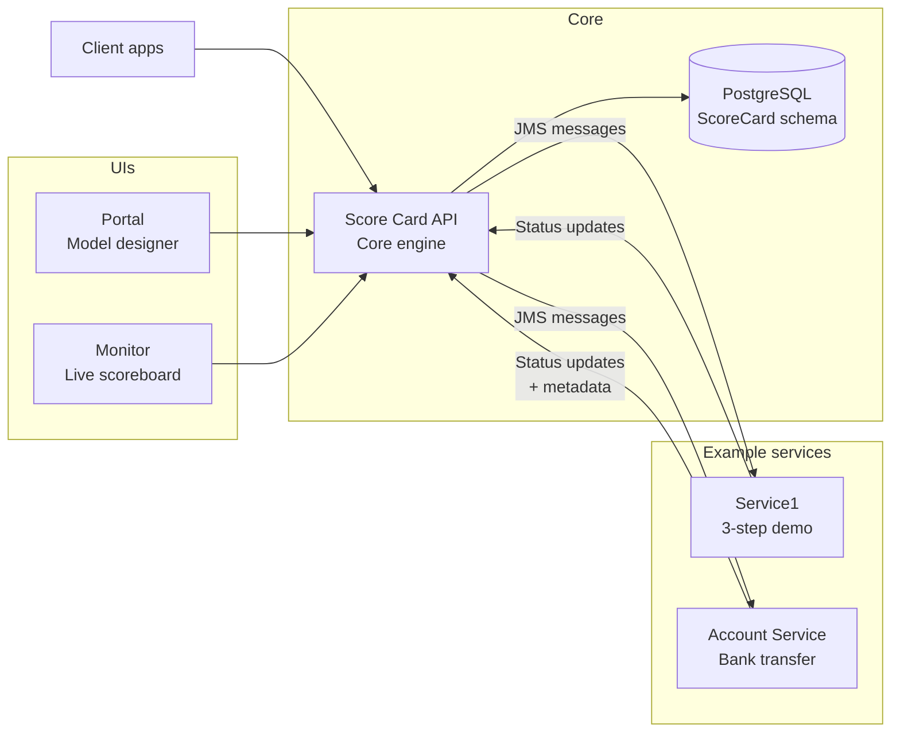

# Score Card

Score Card is a sample implementation of the “score card” pattern: track long‑running, multi‑step transactions, record every action, and surface live status through REST and UI.

## What’s Inside
- **Core API**: the engine for defining services, actions, transactions, and score cards—built for product teams to integrate quickly.
- **Monitor (optional add‑on)**: a live scoreboard to visualize every transaction as it unfolds, with action-level drilldowns.
- **Portal (optional add‑on)**: a guided workspace to design services, wire actions, and build transaction blueprints without touching code.
- **Example services**: ready-made demos that show the end-to-end flow (e.g., a bank transfer) so teams can learn by running.
- **Integration library**: reusable domain models and client helpers (HTTP/JMS) to plug Score Card into your services with minimal effort.

## Data & Messaging
- **Database**: Postgres with Liquibase migrations; seed data for services, actions, transactions, and example accounts.
- **Messaging**: ActiveMQ; messages carry a `SCORE_CARD` header, and producers/consumers use JSON with a `_type` hint for polymorphic payloads.

## How It Works (functionally)
1) Define services and actions (REST or Portal).  
2) Assemble actions into transactions.  
3) Start a score card for a transaction (API or example flow).  
4) JMS messages are dispatched to the service queues; listeners call back to authorize and update status.  
5) Monitor UI shows progress; API exposes the same data for automation.

## Try It
- Use the **Portal** to browse and edit the model.
- Use the **Monitor** to watch score cards update in real time.
- Run the **bank transfer** example to see debit/credit actions execute under one score card.

## Need Setup Details?
See `GETTING_STARTED.md` for environment, Docker Compose, profiles, and run commands. This README stays focused on what the system does; the setup guide covers how to run it.***

# Score Card: Observability-Driven Composition of Loosely Coupled Services into Complex Transactions

_Zach Maddox (zmad5306)_

## Abstract

Cross-service **business transactions** - such as a banking transfer spanning multiple microservices - pose a classic challenge in distributed systems. Without a global transaction manager, each service operates in isolation, making it difficult to coordinate changes, handle partial failures, or maintain consistent end-to-end state. Traditional distributed transactions (e.g., two-phase commit) are often avoided due to their complexity and tight coupling, leaving architects to choose between **strong consistency** and **service independence**. The result is a need for new approaches that can track and reason about a **multi-step, multi-service** process without sacrificing the autonomy of each service.

**Score Card** introduces an observability-driven solution: rather than enforcing a single atomic transaction, it **models complex workflows as a set of independent actions** and uses _observability signals_ - logging events, messages, and metadata - to **reconstruct the transaction's narrative** after the fact. By tracking every step ("action") in a long-running transaction and correlating them under a shared context, Score Card provides a real-time view of progress and outcomes[\[1\]](https://github.com/zmad5306/ScoreCard/blob/b4a6880f80c062c412b1165725aa434bd4c7219b/README.md#L3-L10). This approach yields many benefits: services remain loosely coupled and independently deployable, yet the system can still detect inconsistencies, identify failures, and even trigger compensating actions - all without a traditional distributed lock or coordinator. In summary, Score Card explores how **distributed transactions can be _observed_ and managed as emergent compositions of services** rather than tightly controlled via a central coordinator.

## 1\. Introduction

Modern software systems increasingly adopt a **microservices architecture**, where business capabilities are split across multiple independent services. A single high-level process (for example, "transfer \\\$100 from Account A to Account B") may touch several services - e.g., an Account service debits one account, a Ledger service credits another, a Notification service sends a receipt, etc. Coordinating these steps is notoriously difficult: each service has its own database and commit cycle, and there is often no global transaction context. Classical distributed transactions like two-phase commit (2PC) can ensure atomicity across services, but at a steep cost: they introduce tight coupling, reduce fault tolerance, and can become a scalability bottleneck. In practice, teams often prefer **event-driven sagas** or compensation-based workflows to maintain flexibility. In these patterns, each service performs its local transaction and publishes events; other services react, and if something goes wrong, additional "undo" actions (compensations) are issued. This avoids a single point of coordination, but it raises a critical question: **how do we observe and reason about the overall transaction?** Without a central coordinator, the logic of a cross-service workflow becomes implicit, spread across services and messages.

Score Card is an experimental system that tackles this challenge by shifting focus from orchestration to **observability**. It posits that if each service's actions are adequately instrumented and correlated, one can reconstruct the end-to-end flow of a business transaction without forcing all parties into a single atomic commit. The project explores how far we can go using **domain modeling and distributed tracing techniques** in lieu of a classic transaction manager. We define explicit models for services, actions, and transactions (the planned steps in a workflow), but at runtime we rely on **asynchronous messaging and logging** to track progress. Each service remains in charge of its own data and execution, yet Score Card maintains a "scoreboard" that assembles these disparate actions into a coherent picture. This approach is inspired by ideas from saga patterns and event sourcing (where state changes are logged for later reconstruction), applying them in a new way: the emphasis is not only on eventual data consistency, but also on real-time **insight** into the transaction's state. Score Card can be seen as a research probe into achieving ACID-like observability (if not ACID consistency) in a microservices environment - asking, _how much of a complex transaction's behavior can we understand and manage using only observability signals and domain knowledge, instead of a distributed locking protocol?_

## 2\. Problem Statement

Formally, we consider a scenario with **multiple autonomous services**, each encapsulating its own state and behavior. A _business transaction_ is a higher-level operation (e.g. a funds transfer, an e-commerce order fulfillment, a multi-step account onboarding) that **spans these service boundaries**. Such a transaction consists of a series of _actions_ - operations performed by individual services - which may have logical dependencies (some must happen before others) and which collectively accomplish a business goal. The fundamental problems in this context include:

- **Distributed State Tracking:** Since no single service "owns" the whole transaction, we need a way to track the state of each constituent action and know whether the overall transaction is still in progress, completed successfully, or failed partially. For example, in a transfer, we must know if the debit from Account A succeeded before issuing the credit to Account B, and if the credit failed, we need to detect that and respond appropriately.
- **Correlation of Events:** Actions executed by different services (or even multiple actions within one service) must be correlated to the same logical transaction. In practice, this means generating a unique _transaction identifier_ and ensuring it accompanies every step. Without this, we have a flurry of isolated logs or messages with no way to assemble them into a coherent timeline.
- **Partial Failures & Compensation:** In distributed transactions, some actions may succeed while others fail. There is no automatic rollback across service boundaries, so the system must detect _partial failures_ and decide on corrective measures. One approach is to cancel or skip subsequent actions if an earlier one failed (to prevent compounding the error) - another is to run compensating actions to undo the side-effects of completed steps. The logic for this can be complex, especially if actions have dependencies or if certain failures are tolerable. We need a model to express which actions should run after a failure (if any) and which should be aborted.
- **Consistency vs. Availability:** We aim to avoid a distributed lock or commit protocol in order to keep services available and decoupled. This implies each service will commit its local changes independently, trading immediate global consistency for eventual consistency. The problem then is ensuring that this eventual consistency is monitored and guided. We must answer questions like: _Did all required steps eventually complete?_ If not, _what is the reconciled outcome?_ (e.g., funds debited but not credited - how do we address that?).

In summary, the problem is to enable **end-to-end transactional reasoning without end-to-end transactional locking**. We want the benefits of a global transaction log (auditability, failure detection, state tracking) **without** imposing a global transaction coordinator at runtime. This is closely related to known patterns: a _Saga_ is essentially a set of local transactions with compensation, and the _outbox pattern_ ensures events reliably accompany database commits in each service. Score Card's challenge is to provide an infrastructural backbone that ties these local transactions together into a unified view - essentially creating a _transaction scorecard_ that records every action (with its outcome and metadata) and allows the system or operators to reason about the transaction's state post-factum.

## 3\. System Overview

Score Card is designed as a modular system with clearly separated concerns, akin to components in an academic prototype. The core is a **Score Card API service** ("Core API"), which houses the domain model and transaction logic. Surrounding it are optional components: a **Monitor** service that provides a real-time dashboard UI, a **Portal** service that provides a UI for configuring the model (services, actions, transactions), and a set of **Example services** that simulate external microservices participating in transactions[\[2\]](https://github.com/zmad5306/ScoreCard/blob/b4a6880f80c062c412b1165725aa434bd4c7219b/README.md#L5-L10). A high-level architecture is illustrated below:



**Core API (ScoreCard API)** - This Spring Boot service implements the main Score Card logic. It exposes a RESTful API (under /api/v1/...) through which clients or services can manage transactions and report status. It also connects to a relational **PostgreSQL database** (the "ScoreCard" schema) that stores all definitions (services, actions, transaction blueprints) and records of each transaction execution (the score cards). In addition to HTTP, the Core API listens on a **JMS message queue** (ActiveMQ is used) for integration events: specifically, a queue named **scorecard** where it expects messages to create new score cards or update action statuses[\[3\]](https://github.com/zmad5306/ScoreCard/blob/b4a6880f80c062c412b1165725aa434bd4c7219b/JMS.md#L11-L19). The Core API's responsibilities include: persisting and retrieving the model, initiating transactions (score cards), correlating incoming events to the correct transaction, and enforcing any global logic such as dependency ordering or cancellation policy.

**Monitor (UI)** - This is an optional web application that serves as a live dashboard of ongoing and past transactions. It queries the Core API (or shares the database) to list all _Score Cards_ (transaction instances) and their constituent actions. Using this UI, an operator can watch a transaction as it unfolds - seeing each action move from pending to processing to completed or failed in near-real-time. The Monitor is essentially a read-only view; it does not alter data but provides visualization (e.g., highlighting failed steps or showing timestamps). Under the hood, it's a Spring Boot app serving HTML (the repository's monitor/ module contains Thymeleaf templates for listing scorecards and showing details[\[2\]](https://github.com/zmad5306/ScoreCard/blob/b4a6880f80c062c412b1165725aa434bd4c7219b/README.md#L5-L10)[\[4\]](https://github.com/zmad5306/ScoreCard/blob/b4a6880f80c062c412b1165725aa434bd4c7219b/README.md#L16-L21)).

**Portal (UI)** - Another optional component, the Portal is a configuration interface that allows users to define and modify the domain model without directly editing JSON or using API calls. Through the Portal (also a Spring Boot web app), one can create new Service entries, define Actions under services, and assemble those actions into Transaction blueprints (including specifying dependencies/order). It provides a more user-friendly, guided way to maintain the model, writing to the Core API behind the scenes. The Portal module includes templates and possibly uses Spring Web Flow (as suggested by flow XML files) to guide users through multi-step wizards for adding transactions and selecting actions.

**Example Services** - To demonstrate Score Card in action, the repository includes sample microservices that mimic the behavior of real services in a distributed transaction. Notably, there is a **"Basic" example service** (Service1) and a **"Bank" example** which simulates a simple banking scenario with accounts. These example services are instrumented to integrate with Score Card: they listen on JMS queues for action requests and use the Score Card integration library to respond (more on this integration in Section 5). For instance, the _Account Service example_ listens on a queue account for messages instructing it to debit or credit an account, and the _Basic Service example_ listens on a queue service1 for generic actions (action1, action2, action3). Each example service has its own local logic (e.g., the bank service actually updates account balances in its own database schema), but they all follow a common pattern to report back to Score Card.

**Integration Library** - To ease the development of services that participate in Score Card transactions, the project provides a library (scorecard-lib). This library contains reusable domain model classes (mirroring the core model) and a **ScoreCard API client** which hides the details of communication. Services can include this library and then simply call high-level methods like scoreCardApiService.authorize(header) or scoreCardApiService.updateStatus(header, status) rather than manually constructing HTTP requests or JMS messages. The library supports both REST and JMS modes: e.g., an implementation ScoreCardApiServiceHttp would call the REST endpoints, while ScoreCardApiServiceJms sends JMS messages to the scorecard queue[\[5\]](https://github.com/zmad5306/ScoreCard/blob/b4a6880f80c062c412b1165725aa434bd4c7219b/lib/src/main/java/dev/zachmaddox/scorecard/lib/service/ScoreCardApiServiceJms.java#L34-L42)[\[6\]](https://github.com/zmad5306/ScoreCard/blob/b4a6880f80c062c412b1165725aa434bd4c7219b/lib/src/main/java/dev/zachmaddox/scorecard/lib/service/ScoreCardApiServiceJms.java#L28-L36). The library also helps format the JMS message headers and payloads correctly (using a consistent JSON structure with \_type hints for polymorphism).

All these components are loosely coupled and communicate primarily through well-defined APIs or messages. The Core API is central, but it does not directly invoke methods on the example services - instead, it places messages on queues. The example services likewise do not call each other; their only external coupling is via Score Card (either by JMS or occasional REST calls). This design ensures that each service can evolve independently. Score Card acts as an **observer and coordinator** that ties their actions together _only through data_, not through direct control flow.

## 4\. Modeling Complex Transactions

At the heart of Score Card is a **domain model** that makes cross-service transactions explicit. The model defines the following core concepts:

- **Service:** a representation of an external service or microservice. In the model, a Service has a unique name and a specified _transport type_ (e.g., HTTP or QUEUE) and a _base path_[\[7\]](https://github.com/zmad5306/ScoreCard/blob/b4a6880f80c062c412b1165725aa434bd4c7219b/api/src/main/java/dev/zachmaddox/scorecard/api/domain/Service.java#L40-L48). The base path might be a URL prefix if using HTTP or a messaging address (like a JMS queue name) if using messaging. For example, the seed data includes a service named "account-service" with transport QUEUE and path "account" (indicating messages for this service should go to the account queue)[\[8\]](https://github.com/zmad5306/ScoreCard/blob/b4a6880f80c062c412b1165725aa434bd4c7219b/README.md#L12-L20). Another example is "service1" (also a queue-based service for the Basic demo)[\[9\]](https://github.com/zmad5306/ScoreCard/blob/b4a6880f80c062c412b1165725aa434bd4c7219b/api/src/main/resources/db/changelog/0002-seed-initial-data.yaml#L24-L32)[\[10\]](https://github.com/zmad5306/ScoreCard/blob/b4a6880f80c062c412b1165725aa434bd4c7219b/api/src/main/resources/db/changelog/0002-seed-initial-data.yaml#L78-L86).
- **Action:** a unit of work performed by a service. An Action belongs to exactly one Service. It has a unique identifier and a name (unique within its service)[\[11\]](https://github.com/zmad5306/ScoreCard/blob/b4a6880f80c062c412b1165725aa434bd4c7219b/api/src/main/java/dev/zachmaddox/scorecard/api/domain/Action.java#L48-L56)[\[12\]](https://github.com/zmad5306/ScoreCard/blob/b4a6880f80c062c412b1165725aa434bd4c7219b/api/src/main/java/dev/zachmaddox/scorecard/api/domain/Action.java#L50-L58), as well as a **relative path** and an **HTTP method** if it's an HTTP-based action[\[13\]](https://github.com/zmad5306/ScoreCard/blob/b4a6880f80c062c412b1165725aa434bd4c7219b/api/src/main/java/dev/zachmaddox/scorecard/api/domain/Action.java#L58-L65). For queue-based actions, the path often doubles as a message selector or operation name. In other words, an Action defines "what to do" on a service - e.g., _"debit an account"_, _"send an email"_, _"validate KYC info"_, etc. In the banking example, the Account Service defines two actions: debit and credit, each with a relative path (also "debit" or "credit") and an HTTP method of POST (the method is nominal in the queue scenario, but set for completeness)[\[14\]](https://github.com/zmad5306/ScoreCard/blob/b4a6880f80c062c412b1165725aa434bd4c7219b/api/src/main/resources/db/changelog/0002-seed-initial-data.yaml#L44-L52)[\[15\]](https://github.com/zmad5306/ScoreCard/blob/b4a6880f80c062c412b1165725aa434bd4c7219b/api/src/main/resources/db/changelog/0002-seed-initial-data.yaml#L60-L68). Actions can be thought of as the _verbs_ that services can perform as part of a transaction.
- **Transaction:** a blueprint for a _business transaction_, composed of an ordered set of actions. A Transaction has a unique name (e.g., "bank-transfer", "user-onboarding") and an internally assigned ID[\[16\]](https://github.com/zmad5306/ScoreCard/blob/b4a6880f80c062c412b1165725aa434bd4c7219b/api/src/main/java/dev/zachmaddox/scorecard/api/domain/Transaction.java#L40-L48)[\[17\]](https://github.com/zmad5306/ScoreCard/blob/b4a6880f80c062c412b1165725aa434bd4c7219b/api/src/main/java/dev/zachmaddox/scorecard/api/domain/Transaction.java#L42-L50). Associated with each Transaction is a list of **Transaction Actions**, which tie the transaction to specific Action definitions. This list is ordered or partially ordered, and Score Card allows encoding dependencies among actions. The model supports the idea that some actions may only proceed after others have completed. Concretely, the Transaction entity holds an ordered list of its actions[\[18\]](https://github.com/zmad5306/ScoreCard/blob/b4a6880f80c062c412b1165725aa434bd4c7219b/api/src/main/java/dev/zachmaddox/scorecard/api/domain/Transaction.java#L45-L51). Each entry in that list is a **TransactionAction** object, which links to an Action and optionally to one or more other TransactionActions that it depends on[\[19\]](https://github.com/zmad5306/ScoreCard/blob/b4a6880f80c062c412b1165725aa434bd4c7219b/api/src/main/java/dev/zachmaddox/scorecard/api/domain/TransactionAction.java#L44-L53)[\[20\]](https://github.com/zmad5306/ScoreCard/blob/b4a6880f80c062c412b1165725aa434bd4c7219b/api/src/main/java/dev/zachmaddox/scorecard/api/domain/TransactionAction.java#L50-L58). If A depends on B in the context of this transaction, it means semantically "Action A should not execute until Action B has completed (successfully)." These dependencies form a DAG (directed acyclic graph) of actions for the transaction. They can express simple sequences, parallel steps, or conditional branching (although conditional logic is not explicitly modeled, one could imagine skipping actions via the CANCEL status to handle branching). In the absence of explicit dependencies, the transaction's actions are assumed to be independent or allowed to run concurrently.

To illustrate, consider the **"bank-transfer"** transaction included in the sample data. It consists of two actions: a debit action and a credit action, both targeting the account-service. In the model, this is represented by a Transaction (ID 1, name "bank-transfer") with two TransactionAction entries: one referencing the debit Action (ID 1) and one referencing the credit Action (ID 2). A dependency is set such that the credit TransactionAction depends on the debit TransactionAction[\[21\]](https://github.com/zmad5306/ScoreCard/blob/b4a6880f80c062c412b1165725aa434bd4c7219b/api/src/main/resources/db/changelog/0002-seed-initial-data.yaml#L250-L258). This encodes the business rule that the credit should happen only after the debit has succeeded - reflecting a typical funds transfer logic. Another example from the demo is a transaction named "transaction1" (ID 3 in the seed data), which is composed of three actions (action1, action2, action3 on service1). The dependencies form a linear chain: action2 depends on action1, and action3 depends on action2[\[22\]](https://github.com/zmad5306/ScoreCard/blob/b4a6880f80c062c412b1165725aa434bd4c7219b/api/src/main/resources/db/changelog/0002-seed-initial-data.yaml#L262-L270)[\[23\]](https://github.com/zmad5306/ScoreCard/blob/b4a6880f80c062c412b1165725aa434bd4c7219b/api/src/main/resources/db/changelog/0002-seed-initial-data.yaml#L270-L277). Thus, "transaction1" will execute as a sequence in that order. These examples show how Score Card's model can represent both **serial workflows** and **parallel or concurrent steps** (if no dependency is specified between two actions, they can proceed in parallel, subject to service availability).

- **Score Card (Transaction Instance):** While the above defines the static blueprint, a Score Card is the _runtime instance_ of a transaction - analogous to a transaction log or context for one execution. When a client or system starts a new transaction, Score Card creates a new ScoreCard record. This record has a unique **ScoreCard ID**, and it references the Transaction definition (by ID and name) that it is executing[\[24\]](https://github.com/zmad5306/ScoreCard/blob/b4a6880f80c062c412b1165725aa434bd4c7219b/api/src/main/java/dev/zachmaddox/scorecard/api/domain/ScoreCard.java#L34-L42). The ScoreCard ID is fundamental: it serves as the correlation key that will tie together all actions of this transaction execution across various services. The ScoreCard entity also carries a collection of **ScoreCardAction** entries[\[25\]](https://github.com/zmad5306/ScoreCard/blob/b4a6880f80c062c412b1165725aa434bd4c7219b/api/src/main/java/dev/zachmaddox/scorecard/api/domain/ScoreCard.java#L38-L45), each corresponding to one action from the blueprint. A ScoreCardAction is essentially the runtime state of an action: it knows which Action definition it corresponds to (by storing the Action's ID and name)[\[26\]](https://github.com/zmad5306/ScoreCard/blob/b4a6880f80c062c412b1165725aa434bd4c7219b/api/src/main/java/dev/zachmaddox/scorecard/api/domain/ScoreCardAction.java#L56-L64), which Score Card (transaction) it belongs to, and it tracks the action's current **status**[\[27\]](https://github.com/zmad5306/ScoreCard/blob/b4a6880f80c062c412b1165725aa434bd4c7219b/api/src/main/java/dev/zachmaddox/scorecard/api/domain/ScoreCardAction.java#L60-L68). Status is an enumeration with values like _PENDING_, _PROCESSING_, _COMPLETED_, _FAILED_, _CANCELLED_, _UNKNOWN_[\[28\]](https://github.com/zmad5306/ScoreCard/blob/b4a6880f80c062c412b1165725aa434bd4c7219b/common/src/main/java/dev/zachmaddox/scorecard/common/domain/ScoreCardActionStatus.java#L3-L6), representing the lifecycle of each step. A freshly created Score Card will have all its actions initialized with status _PENDING_. As the transaction executes, these statuses will be updated to reflect reality (e.g., an action moves to PROCESSING when the service picks it up, then to COMPLETED or FAILED depending on outcome). The ScoreCardAction also records timestamps (startTimestamp, endTimestamp) for performance and audit (when did this action actually run)[\[29\]](https://github.com/zmad5306/ScoreCard/blob/b4a6880f80c062c412b1165725aa434bd4c7219b/api/src/main/java/dev/zachmaddox/scorecard/api/domain/ScoreCardAction.java#L62-L70)[\[30\]](https://github.com/zmad5306/ScoreCard/blob/b4a6880f80c062c412b1165725aa434bd4c7219b/api/src/main/java/dev/zachmaddox/scorecard/api/service/ScoreCardService.java#L240-L248). Crucially, ScoreCardAction carries the **dependency links at runtime** as well: each ScoreCardAction has a set of references to other ScoreCardActions that it _depends on_[\[31\]](https://github.com/zmad5306/ScoreCard/blob/b4a6880f80c062c412b1165725aa434bd4c7219b/api/src/main/java/dev/zachmaddox/scorecard/api/domain/ScoreCardAction.java#L74-L82). These are copied from the Transaction blueprint at creation time, so the runtime instance knows, for example, "Action credit depends on action debit" (but now referring to the specific ScoreCardAction IDs of this execution). This enables the system to check, at run time, whether prerequisites are done before allowing an action to proceed.
- **Correlation Identifiers:** Every Score Card instance is identified by a numeric ID (score_card_id), which is globally unique. This ID is the linchpin for correlating events. When a new score card is to be created, clients can request the next available ID via an API call[\[32\]](https://github.com/zmad5306/ScoreCard/blob/b4a6880f80c062c412b1165725aa434bd4c7219b/api/src/main/java/dev/zachmaddox/scorecard/api/web/api/ScoreCardController.java#L83-L91) (or the system can auto-generate one). That ID is then used in all subsequent communications about this transaction. For example, when Score Card dispatches a request to an external service to perform an action, it attaches the ScoreCard ID (and the specific Action ID) in the message header. In the JMS integration, this is done through a custom JMS header called SCORE_CARD which carries a JSON payload containing the scoreCardId and actionId[\[33\]](https://github.com/zmad5306/ScoreCard/blob/b4a6880f80c062c412b1165725aa434bd4c7219b/JMS.md#L20-L28). This way, when the external service receives a message "please execute action X," it knows the context: "this is part of transaction with ScoreCard ID 123." Likewise, when the service reports back its status, it includes the same identifiers so Score Card knows which record to update. This scheme is analogous to a distributed trace ID in tracing systems - here the ScoreCard ID serves a similar role to tie together a distributed workflow. In addition, each action has a stable Action ID (from the model) which, combined with the ScoreCard ID, uniquely identifies the specific step in that transaction. The use of composite keys (scoreCardId + actionId) means even if the same action is used in many transactions or multiple times in one transaction (the latter was not shown in examples but the model could allow it), we can distinguish which execution we're talking about.

By explicitly modeling the above, Score Card creates a **semantic framework** for cross-service transactions. It's important to note that this model is _declarative_: defining what the steps are and how they depend on each other, but not prescribing exactly how services must implement them. Services remain free to implement the actions as they see fit (e.g., debit might do a database update and return). Score Card's job is to observe and record. The next section will discuss how those observations happen via an observability layer and how the system uses this model to tie everything together at runtime.

## 5\. Observability and Loose Coupling

Score Card's execution model is built on **event-driven observability**. Rather than invoking services through tight integrations (such as direct REST calls expecting immediate responses), Score Card uses a publish/subscribe or messaging approach to trigger actions and then listens for outcomes. This design choice ensures that the services participating in a transaction are only loosely coupled to Score Card and **not directly to each other**. Each service simply knows: "I will receive a message requesting an action, and I should eventually report back what happened." The coordination is achieved through the data (messages and status updates) rather than through hardwired procedure calls.

Concretely, when a Score Card is started, the Core API will dispatch messages for each action (often all at once, though it could be staggered). In the current implementation, this is done via JMS: for each action in the transaction, a message containing the action's input data is sent to the appropriate **service queue**[\[3\]](https://github.com/zmad5306/ScoreCard/blob/b4a6880f80c062c412b1165725aa434bd4c7219b/JMS.md#L11-L19). The queue name is the Service's base path (for example, messages for account-service go to queue "account", as configured in the Service definition[\[34\]](https://github.com/zmad5306/ScoreCard/blob/b4a6880f80c062c412b1165725aa434bd4c7219b/api/src/main/resources/db/changelog/0002-seed-initial-data.yaml#L14-L22)[\[35\]](https://github.com/zmad5306/ScoreCard/blob/b4a6880f80c062c412b1165725aa434bd4c7219b/api/src/main/resources/db/changelog/0002-seed-initial-data.yaml#L8-L16)). Each message has a property ACTION set to the action's name (e.g., "debit"), so that a service can use a selector to pick only messages intended for a particular action type[\[36\]](https://github.com/zmad5306/ScoreCard/blob/b4a6880f80c062c412b1165725aa434bd4c7219b/JMS.md#L16-L24). Importantly, each message carries the SCORE_CARD header with the transaction context[\[33\]](https://github.com/zmad5306/ScoreCard/blob/b4a6880f80c062c412b1165725aa434bd4c7219b/JMS.md#L20-L28). In the JMS payload convention used, a custom object ScoreCardHeader is serialized as JSON in this header, containing the ScoreCard ID and Action ID (and optionally the action path)[\[37\]](https://github.com/zmad5306/ScoreCard/blob/b4a6880f80c062c412b1165725aa434bd4c7219b/lib/src/main/java/dev/zachmaddox/scorecard/lib/service/ScoreCardPostProcessor.java#L26-L34)[\[38\]](https://github.com/zmad5306/ScoreCard/blob/b4a6880f80c062c412b1165725aa434bd4c7219b/lib/src/main/java/dev/zachmaddox/scorecard/lib/service/ScoreCardPostProcessor.java#L28-L31). This means all the information to correlate and identify the action is attached to the message itself.

On the **service side**, the microservice simply listens to its queue and processes messages as they come. Since multiple actions for the same service might be running, the service can register separate listeners or use message selectors. For example, the Account Service example has two listeners on the "account" queue: one filtering ACTION='debit' and the other ACTION='credit'. When a **DebitRequest** arrives, the debit listener wakes up and receives the message along with the SCORE_CARD header. At this point, the service performs an _authorization check_ via Score Card's integration API before doing the work. This is a crucial aspect of maintaining loose coupling while respecting dependencies: the service asks Score Card **"Should I proceed with this action now?"**. It does so by calling the authorize method, passing in the ScoreCard header (which includes scoreCardId and actionId)[\[39\]](https://github.com/zmad5306/ScoreCard/blob/b4a6880f80c062c412b1165725aa434bd4c7219b/example/src/main/java/dev/zachmaddox/scorecard/example/basic/service/BasicService.java#L27-L35). Under the hood, this triggers a fast call to the Core API (either via JMS or REST) to determine if the action is allowed to run. Score Card's logic will respond with one of several decisions (an Authorization result): **PROCESS** (go ahead now), **WAIT** (dependencies not satisfied, please try again later), **CANCEL** (do not execute because the overall transaction is being aborted), or **SKIP** (action is already handled or irrelevant)[\[40\]](https://github.com/zmad5306/ScoreCard/blob/b4a6880f80c062c412b1165725aa434bd4c7219b/common/src/main/java/dev/zachmaddox/scorecard/common/domain/Authorization.java#L3-L6)[\[41\]](https://github.com/zmad5306/ScoreCard/blob/b4a6880f80c062c412b1165725aa434bd4c7219b/api/src/main/java/dev/zachmaddox/scorecard/api/service/ScoreCardService.java#L168-L176). This mechanism is how Score Card enforces ordering _without directly controlling the flow_: if an action arrives out of order (say, a credit arrives before the debit completed), the Account Service's call to authorize will return _WAIT_, and the service will then typically **throw a WaitException** to indicate it cannot process yet[\[42\]](https://github.com/zmad5306/ScoreCard/blob/b4a6880f80c062c412b1165725aa434bd4c7219b/example/src/main/java/dev/zachmaddox/scorecard/example/basic/service/BasicService.java#L40-L45)[\[39\]](https://github.com/zmad5306/ScoreCard/blob/b4a6880f80c062c412b1165725aa434bd4c7219b/example/src/main/java/dev/zachmaddox/scorecard/example/basic/service/BasicService.java#L27-L35). In a JMS listener, throwing an exception like that causes the message to be redelivered later (ActiveMQ and Spring will treat it as a transient failure). Thus, the message for credit will go back to the queue and the service will only complete it once the dependency condition changes (i.e., after debit action completes, Score Card will then return PROCESS for the credit on a subsequent attempt). This approach leverages the messaging system's retry mechanism to achieve ordering, rather than requiring Score Card to micromanage the sequence. It keeps services simple: from the service's perspective, **either it's cleared to run, or it isn't**; if not, it just waits (the message looping in the queue until ready). There is no direct coupling between the debit and credit handlers - Score Card sits in the middle as a referee that knows the dependency graph.

Once a service's action is authorized and executes, the service performs its normal logic. It then must report the outcome. This is done by sending an **update event** back to Score Card. In JMS mode, the service sends a message to the scorecard queue with a property ACTION='UPDATE' and a body containing an UpdateRequest object[\[3\]](https://github.com/zmad5306/ScoreCard/blob/b4a6880f80c062c412b1165725aa434bd4c7219b/JMS.md#L11-L19)[\[43\]](https://github.com/zmad5306/ScoreCard/blob/b4a6880f80c062c412b1165725aa434bd4c7219b/JMS.md#L34-L41). The UpdateRequest includes the ScoreCard ID, the Action ID, the new status (e.g., COMPLETED or FAILED), and optionally a metadata map[\[44\]](https://github.com/zmad5306/ScoreCard/blob/b4a6880f80c062c412b1165725aa434bd4c7219b/JMS.md#L35-L42)[\[45\]](https://github.com/zmad5306/ScoreCard/blob/b4a6880f80c062c412b1165725aa434bd4c7219b/common/src/main/java/dev/zachmaddox/scorecard/common/domain/UpdateRequest.java#L24-L32). The Core API, which has a JMS listener on the scorecard queue, will consume this and update the corresponding ScoreCardAction in the database[\[46\]](https://github.com/zmad5306/ScoreCard/blob/b4a6880f80c062c412b1165725aa434bd4c7219b/api/src/main/java/dev/zachmaddox/scorecard/api/messaging/ScoreCardReceiver.java#L17-L25)[\[47\]](https://github.com/zmad5306/ScoreCard/blob/b4a6880f80c062c412b1165725aa434bd4c7219b/api/src/main/java/dev/zachmaddox/scorecard/api/messaging/ScoreCardReceiver.java#L23-L30). If instead the service uses the REST integration, it would call the Core API's endpoint (POST to /api/v1/scorecard/{scoreCardId}) with the update payload[\[48\]](https://github.com/zmad5306/ScoreCard/blob/b4a6880f80c062c412b1165725aa434bd4c7219b/api/src/main/java/dev/zachmaddox/scorecard/api/web/api/ScoreCardController.java#L118-L126) - the effect is the same. The key point is that **services do not directly modify each other's state, and Score Card does not modify service state**; rather, all coordination happens by exchanging messages about state. Each service knows only about Score Card (which it treats as an observability endpoint or transaction context provider), not about the other services in the transaction. For example, the Account Service doesn't know whether the counterpart credit or debit has happened - it relies on Score Card authorization to implicitly handle that knowledge.

This design preserves **loose coupling**: services remain unaware of the broader transaction beyond tagging along with a ScoreCard ID. They don't call each other or share databases. They could even be written in different languages or maintained by different teams - as long as they follow the protocol of sending updates and (optionally) checking authorization, they can participate. Score Card itself is the only place where the entire transaction is understood. Think of it as a specialized **distributed transaction log** combined with a lightweight rule engine for dependencies. All communication is via **asynchronous, non-blocking channels** (messaging or async HTTP), so if one service is slow or down, others and the Score Card itself remain available (though the transaction might not complete until all parts have reported).

Meanwhile, Score Card's observability features gather rich data: Each ScoreCardAction entry accumulates status and _metadata_ provided by services. Metadata is arbitrary key-value pairs that services can attach to updates[\[49\]](https://github.com/zmad5306/ScoreCard/blob/b4a6880f80c062c412b1165725aa434bd4c7219b/api/src/main/java/dev/zachmaddox/scorecard/api/domain/ScoreCardAction.java#L80-L88). In the bank example, if a debit fails due to insufficient funds, the Account Service attaches an error code like "NSF" (non-sufficient funds) in the metadata when marking the action as FAILED[\[50\]](https://github.com/zmad5306/ScoreCard/blob/b4a6880f80c062c412b1165725aa434bd4c7219b/example/src/main/java/dev/zachmaddox/scorecard/example/bank/messaging/TransactionProcessingService.java#L38-L46)[\[51\]](https://github.com/zmad5306/ScoreCard/blob/b4a6880f80c062c412b1165725aa434bd4c7219b/example/src/main/java/dev/zachmaddox/scorecard/example/bank/messaging/TransactionProcessingService.java#L40-L48). Similarly, when a debit succeeds, it attaches the generated transaction ID from its own database as metadata (so that it can be used later for potential reversal)[\[52\]](https://github.com/zmad5306/ScoreCard/blob/b4a6880f80c062c412b1165725aa434bd4c7219b/example/src/main/java/dev/zachmaddox/scorecard/example/bank/messaging/TransactionProcessingService.java#L50-L58)[\[53\]](https://github.com/zmad5306/ScoreCard/blob/b4a6880f80c062c412b1165725aa434bd4c7219b/example/src/main/java/dev/zachmaddox/scorecard/example/bank/messaging/TransactionProcessingService.java#L52-L56). Score Card stores this metadata along with the action. This means the observability is not just binary success/failure, but can include domain context (error codes, identifiers, even payload excerpts if desired). The Monitor UI can display these metadata fields, and operators or automated processes (see Section 7) can query them to decide on remedial actions. All of this is achieved without hard-coding any domain logic into Score Card - the domain logic lives in the services, which simply log their context to Score Card. In essence, Score Card enables an **observability-driven form of coordination**: rather than a central brain telling each service what to do next in lockstep, each service operates and reports, and Score Card's view of the world evolves. The minimal synchronization (the authorize call) is just enough to respect explicit dependencies and global cancellation policy, but otherwise doesn't impose on the services' internal logic.

Finally, it is worth noting that Score Card's approach aligns with the principle of **independent scalability and deployability**. Because it uses asynchronous messaging and loose coupling, each service (including Score Card itself) can scale out (run in multiple instances) or be upgraded independently. Score Card does not introduce a single point of failure for the whole system's data consistency - if Score Card is temporarily unavailable, services could continue local work and perhaps queue up their update messages (though in the current design, Score Card should be running to authorize and record events; enhancements could include fallback behaviors). Conversely, if a service is down, Score Card will mark its actions as pending and the messages will remain in the queue until the service comes back. The system favors availability and eventual consistency: there is no global lock that would cause the whole transaction to abort immediately if one part is slow. Instead, things can wait in queues and time out or be compensated if needed. This is a conscious trade-off to achieve loose coupling: we gain resilience and flexibility, at the cost that some transactions might be incomplete for a while and require monitoring or manual intervention.

## 6\. Implementation Details

The Score Card project is implemented in Java (JDK 21) using the Spring Boot framework (v3.x) for rapid development of the different components. The **technology stack** includes: Spring MVC/Web for REST APIs, Spring Data JPA for persistence with a PostgreSQL database, Spring JMS for messaging with an ActiveMQ broker, and Thymeleaf with Spring MVC for the UI components. The codebase is organized as a Gradle multi-module project, with each major component in its own module (as described in the previous section).

**Database and Persistence:** Score Card uses **PostgreSQL** as the relational database to store its state. Database schema management is handled via Liquibase, and the project includes migration files that set up all necessary tables on startup[\[54\]](https://github.com/zmad5306/ScoreCard/blob/b4a6880f80c062c412b1165725aa434bd4c7219b/README.md#L12-L14). The schema defines tables for SERVICE, ACTION, TRANSACTION, junction tables for transaction-action relationships and dependencies, and tables for runtime data like SCORE_CARD and SCORE_CARD_ACTION (plus their dependency and metadata sub-tables). Each JPA entity in the Core API corresponds closely to one of these tables. For example, the Service entity maps to the SERVICE table (with fields like name and transport)[\[7\]](https://github.com/zmad5306/ScoreCard/blob/b4a6880f80c062c412b1165725aa434bd4c7219b/api/src/main/java/dev/zachmaddox/scorecard/api/domain/Service.java#L40-L48), Action to the ACTION table (including service_id as a foreign key)[\[55\]](https://github.com/zmad5306/ScoreCard/blob/b4a6880f80c062c412b1165725aa434bd4c7219b/api/src/main/java/dev/zachmaddox/scorecard/api/domain/Action.java#L52-L60)[\[13\]](https://github.com/zmad5306/ScoreCard/blob/b4a6880f80c062c412b1165725aa434bd4c7219b/api/src/main/java/dev/zachmaddox/scorecard/api/domain/Action.java#L58-L65), Transaction to the TRANSACTION table[\[56\]](https://github.com/zmad5306/ScoreCard/blob/b4a6880f80c062c412b1165725aa434bd4c7219b/api/src/main/java/dev/zachmaddox/scorecard/api/domain/Transaction.java#L30-L38)[\[16\]](https://github.com/zmad5306/ScoreCard/blob/b4a6880f80c062c412b1165725aa434bd4c7219b/api/src/main/java/dev/zachmaddox/scorecard/api/domain/Transaction.java#L40-L48), etc. The relationship mappings in JPA ensure that, for instance, when you load a Transaction, you can get its list of actions (TransactionActions) and then each associated Action. The Score Card runtime data is similarly structured: a ScoreCard entity for the SCORE_CARD table, and ScoreCardAction for the SCORE_CARD_ACTION table[\[24\]](https://github.com/zmad5306/ScoreCard/blob/b4a6880f80c062c412b1165725aa434bd4c7219b/api/src/main/java/dev/zachmaddox/scorecard/api/domain/ScoreCard.java#L34-L42)[\[57\]](https://github.com/zmad5306/ScoreCard/blob/b4a6880f80c062c412b1165725aa434bd4c7219b/api/src/main/java/dev/zachmaddox/scorecard/api/domain/ScoreCardAction.java#L48-L56). These runtime entities are linked to the static definitions by IDs (e.g., each ScoreCardAction stores an actionId referencing the Action definition that it represents[\[26\]](https://github.com/zmad5306/ScoreCard/blob/b4a6880f80c062c412b1165725aa434bd4c7219b/api/src/main/java/dev/zachmaddox/scorecard/api/domain/ScoreCardAction.java#L56-L64)). The use of JPA/Hibernate allows the code to express queries like "find all score cards where an action has FAILED status" or "count how many actions in this score card are still pending," and let the ORM translate that to SQL.

**Transaction Management and State Enforcement:** The Core API uses Spring's @Transactional to demarcate its operations. Notably, when a ScoreCard is created or updated, those operations occur within a database transaction on the Score Card service. For example, the ScoreCardService.createScoreCard() method is transactional - it inserts the ScoreCard and all its ScoreCardAction children in one go[\[58\]](https://github.com/zmad5306/ScoreCard/blob/b4a6880f80c062c412b1165725aa434bd4c7219b/api/src/main/java/dev/zachmaddox/scorecard/api/service/ScoreCardService.java#L69-L77)[\[59\]](https://github.com/zmad5306/ScoreCard/blob/b4a6880f80c062c412b1165725aa434bd4c7219b/api/src/main/java/dev/zachmaddox/scorecard/api/service/ScoreCardService.java#L85-L93). Similarly, updating an action's status is done in a transaction to ensure consistency (so that, for instance, setting an action to COMPLETED and recording its end timestamp happen atomically). Because Score Card also interacts with JMS, Spring's integration ensures that JMS message consumption can be tied to database transactions: the JMS listener (using Spring's DefaultJmsListenerContainerFactory) can be configured to use a local transaction that encompasses reading the message and performing the DB update. If the DB update fails, the message is not acknowledged and can be retried. This guarantees that Score Card's internal state is reliable and in sync with the messages processed.

The Score Card logic enforces allowed state transitions. In code, a static map defines which status transitions are valid (e.g., from PENDING you may go to PROCESSING or CANCELLED; from PROCESSING you may go to COMPLETED/FAILED/UNKNOWN; etc.)[\[60\]](https://github.com/zmad5306/ScoreCard/blob/b4a6880f80c062c412b1165725aa434bd4c7219b/api/src/main/java/dev/zachmaddox/scorecard/api/service/ScoreCardService.java#L38-L46). If an invalid transition is attempted (say a direct PENDING -> COMPLETED without going through PROCESSING), the service throws an exception or flags it[\[61\]](https://github.com/zmad5306/ScoreCard/blob/b4a6880f80c062c412b1165725aa434bd4c7219b/api/src/main/java/dev/zachmaddox/scorecard/api/service/ScoreCardService.java#L228-L237). This protects the data from contradictory updates. There are TODO comments indicating future refinement (for example, instead of rejecting a late update that tries to mark an unprocessed action Completed, the design might move it to UNKNOWN status in the future)[\[61\]](https://github.com/zmad5306/ScoreCard/blob/b4a6880f80c062c412b1165725aa434bd4c7219b/api/src/main/java/dev/zachmaddox/scorecard/api/service/ScoreCardService.java#L228-L237).

**REST API:** The Core API exposes a set of REST endpoints under /api/v1/ (documented with OpenAPI annotations, and the app even hosts an OpenAPI UI by redirecting the root URL to API docs). Key endpoints include: listing or filtering Score Cards (GET /scorecard with optional query params), retrieving a specific Score Card (GET /scorecard/{id}), getting the next available ScoreCard ID (GET /scorecard/id for clients who want to reserve an ID)[\[32\]](https://github.com/zmad5306/ScoreCard/blob/b4a6880f80c062c412b1165725aa434bd4c7219b/api/src/main/java/dev/zachmaddox/scorecard/api/web/api/ScoreCardController.java#L83-L91), creating a Score Card (PUT /scorecard with a JSON body specifying the chosen scoreCardId and the transactionId to start[\[62\]](https://github.com/zmad5306/ScoreCard/blob/b4a6880f80c062c412b1165725aa434bd4c7219b/api/src/main/java/dev/zachmaddox/scorecard/api/web/api/ScoreCardController.java#L100-L108)), authorizing an action (POST /scorecard with an AuthorizationRequest body[\[63\]](https://github.com/zmad5306/ScoreCard/blob/b4a6880f80c062c412b1165725aa434bd4c7219b/api/src/main/java/dev/zachmaddox/scorecard/api/web/api/ScoreCardController.java#L109-L117)), and updating an action status (POST /scorecard/{id} with an UpdateRequest body to update that specific score card)[\[48\]](https://github.com/zmad5306/ScoreCard/blob/b4a6880f80c062c412b1165725aa434bd4c7219b/api/src/main/java/dev/zachmaddox/scorecard/api/web/api/ScoreCardController.java#L118-L126). There are parallel sets of endpoints for managing the static model: e.g., GET /transaction/list to list all defined transactions, POST /transaction to create/update a transaction blueprint[\[64\]](https://github.com/zmad5306/ScoreCard/blob/b4a6880f80c062c412b1165725aa434bd4c7219b/api/src/main/java/dev/zachmaddox/scorecard/api/web/api/TransactionController.java#L30-L39)[\[65\]](https://github.com/zmad5306/ScoreCard/blob/b4a6880f80c062c412b1165725aa434bd4c7219b/api/src/main/java/dev/zachmaddox/scorecard/api/web/api/TransactionController.java#L56-L64), similar endpoints for service and action (creating and listing services, etc.)[\[66\]](https://github.com/zmad5306/ScoreCard/blob/b4a6880f80c062c412b1165725aa434bd4c7219b/api/src/main/java/dev/zachmaddox/scorecard/api/web/api/ActionController.java#L68-L76)[\[67\]](https://github.com/zmad5306/ScoreCard/blob/b4a6880f80c062c412b1165725aa434bd4c7219b/api/src/main/java/dev/zachmaddox/scorecard/api/web/api/ActionController.java#L34-L42). These allow the Portal UI (or any API client) to programmatically configure the services and transactions. The REST API returns JSON representations of the model objects and uses standard HTTP response codes for success or errors (400 for invalid requests, 404 if something not found, etc., as annotated in the controllers).

**Messaging:** As detailed earlier, ActiveMQ is used as the JMS broker. The system defines two kinds of destinations: a common **scorecard queue** for inbound messages to the Score Card API (create and update requests) and individual **service queues** (named after each service's path) for outbound messages to services[\[3\]](https://github.com/zmad5306/ScoreCard/blob/b4a6880f80c062c412b1165725aa434bd4c7219b/JMS.md#L11-L19). The project uses Spring's JmsTemplate to send messages and @JmsListener annotations to receive them. A custom MessagePostProcessor (ScoreCardPostProcessor) is used to inject the SCORE_CARD header and ACTION property on outgoing messages automatically[\[37\]](https://github.com/zmad5306/ScoreCard/blob/b4a6880f80c062c412b1165725aa434bd4c7219b/lib/src/main/java/dev/zachmaddox/scorecard/lib/service/ScoreCardPostProcessor.java#L26-L34)[\[38\]](https://github.com/zmad5306/ScoreCard/blob/b4a6880f80c062c412b1165725aa434bd4c7219b/lib/src/main/java/dev/zachmaddox/scorecard/lib/service/ScoreCardPostProcessor.java#L28-L31). Similarly, a simple MessagePostProcessor (named MessageSelectorPostProcessor) is used to set the ACTION property on the Create and Update messages sent to the scorecard queue[\[68\]](https://github.com/zmad5306/ScoreCard/blob/b4a6880f80c062c412b1165725aa434bd4c7219b/lib/src/main/java/dev/zachmaddox/scorecard/lib/service/ScoreCardApiServiceJms.java#L26-L34)[\[6\]](https://github.com/zmad5306/ScoreCard/blob/b4a6880f80c062c412b1165725aa434bd4c7219b/lib/src/main/java/dev/zachmaddox/scorecard/lib/service/ScoreCardApiServiceJms.java#L28-L36). This allows the Score Card API's single queue to have multiple listeners distinguished by JMS selectors: one listener picks up ACTION='CREATE' messages and routes to createScoreCard logic, another picks up ACTION='UPDATE' for update logic[\[46\]](https://github.com/zmad5306/ScoreCard/blob/b4a6880f80c062c412b1165725aa434bd4c7219b/api/src/main/java/dev/zachmaddox/scorecard/api/messaging/ScoreCardReceiver.java#L17-L25)[\[47\]](https://github.com/zmad5306/ScoreCard/blob/b4a6880f80c062c412b1165725aa434bd4c7219b/api/src/main/java/dev/zachmaddox/scorecard/api/messaging/ScoreCardReceiver.java#L23-L30). This design makes it easy to integrate new message types if needed in the future (just add a new selector and handler). The payloads for messages are simple JSON-serialized DTOs, which include a \_type field (this is configured via Spring's Jackson message converter and the trust in package names)[\[69\]](https://github.com/zmad5306/ScoreCard/blob/b4a6880f80c062c412b1165725aa434bd4c7219b/JMS.md#L6-L14). For instance, a CreateRequest message looks like {"\_type": "dev.zachmaddox.scorecard.common.domain.CreateRequest", "score_card_id":123, "transaction_id":42}[\[70\]](https://github.com/zmad5306/ScoreCard/blob/b4a6880f80c062c412b1165725aa434bd4c7219b/JMS.md#L29-L37). This \_type field is how the system ensures polymorphic deserialization - it knows to construct a CreateRequest object from that message. Only classes in allowed packages (dev.zachmaddox.scorecard.\*) are trusted for deserialization for security[\[71\]](https://github.com/zmad5306/ScoreCard/blob/b4a6880f80c062c412b1165725aa434bd4c7219b/JMS.md#L55-L58).

**Temporal aspects:** The system doesn't have a built-in time-out or scheduler for incomplete transactions (other than the example's specific repair job, see Section 7). However, since actions remain PENDING until processed, one could extend the system to periodically check for stale scorecards. The database records timestamps, so it would be straightforward to add a query for "score cards where start time of some action exceeds a threshold with no completion," but that logic would be left to future work or external monitoring.

**Design Patterns:** Score Card's architecture hints at _Hexagonal Architecture (Ports and Adapters)_. The Core API is the domain and persistence logic (one side of the hexagon), and it has adapters for incoming requests (REST controllers, JMS listeners) and outgoing communications (JMS producers to services). The integration library further plays the role of an adapter on the service side, providing a stable interface (methods like authorize() and updateStatus()) as a _port_ for any service to plug into Score Card, whether via HTTP or JMS. The domain model is reminiscent of DDD (Domain-Driven Design) patterns: for example, the Transaction with its collection of actions can be seen as an aggregate, and ScoreCard + ScoreCardActions as another aggregate capturing a transaction execution. The code uses repository patterns (Spring Data repositories for basic CRUD on entities like ScoreCardRepository, TransactionRepository, etc.), and uses services (e.g., ScoreCardService, TransactionService) to encapsulate business logic. There is also extensive use of Lombok to reduce boilerplate (getters, setters, etc.) and of Spring's validation annotations to enforce constraints at the API boundaries.

**Error Handling:** Errors in the Score Card API (like requesting a transaction ID that doesn't exist, or an illegal state transition) result in custom exceptions (ScoreCardClientException) with specific error codes (defined in an enum ScoreCardErrorCode). These are likely translated to HTTP 400 responses with appropriate messages. On the messaging side, if something catastrophic happens (e.g., JMS conversion error), the message might be sent to a dead-letter queue; but within normal operation, most errors are domain errors that either result in a controlled exception (e.g., trying to start a score card with an ID that's already in use yields error code SCORE_CARD_ID_IN_USE)[\[72\]](https://github.com/zmad5306/ScoreCard/blob/b4a6880f80c062c412b1165725aa434bd4c7219b/api/src/main/java/dev/zachmaddox/scorecard/api/service/ScoreCardService.java#L70-L78).

In summary, Score Card's implementation emphasizes clarity and separation: each component (API, Monitor, Portal, examples) is largely standalone, communicating via REST or JMS. The consistent use of Java records and DTOs for requests (CreateRequest, UpdateRequest, AuthorizationRequest) ensures that the messages and API payloads are well-defined and documented[\[70\]](https://github.com/zmad5306/ScoreCard/blob/b4a6880f80c062c412b1165725aa434bd4c7219b/JMS.md#L29-L37)[\[44\]](https://github.com/zmad5306/ScoreCard/blob/b4a6880f80c062c412b1165725aa434bd4c7219b/JMS.md#L35-L42). The choice of standard infrastructure (ActiveMQ and Postgres) means the system can run in typical enterprise environments, and Docker Compose is provided to run these dependencies easily for local testing[\[73\]](https://github.com/zmad5306/ScoreCard/blob/b4a6880f80c062c412b1165725aa434bd4c7219b/GETTING_STARTED.md#L9-L17). The next section evaluates how these pieces come together in practice through example scenarios.

## 7\. Evaluation & Example Scenarios

We evaluate Score Card qualitatively through the provided example scenarios. The two main demos - a **basic multi-step workflow** and a **bank fund transfer** - illustrate how Score Card handles complex transactions.

**Scenario 1: Three-Step Workflow (Service1 example).** In this scenario, we have a single service ("service1") with three actions to be executed in order: action1, action2, action3. The transaction blueprint "transaction1" encodes the sequence: action2 depends on action1, action3 depends on action2[\[22\]](https://github.com/zmad5306/ScoreCard/blob/b4a6880f80c062c412b1165725aa434bd4c7219b/api/src/main/resources/db/changelog/0002-seed-initial-data.yaml#L262-L270)[\[23\]](https://github.com/zmad5306/ScoreCard/blob/b4a6880f80c062c412b1165725aa434bd4c7219b/api/src/main/resources/db/changelog/0002-seed-initial-data.yaml#L270-L277). When we trigger this flow (for example, via the ExampleController), the following happens: (1) The client calls the example's endpoint to start the flow. The ExampleController obtains the Transaction definition for "transaction1" from the API and requests a new Score Card ID[\[74\]](https://github.com/zmad5306/ScoreCard/blob/b4a6880f80c062c412b1165725aa434bd4c7219b/example/src/main/java/dev/zachmaddox/scorecard/example/basic/web/api/ExampleController.java#L29-L37)[\[75\]](https://github.com/zmad5306/ScoreCard/blob/b4a6880f80c062c412b1165725aa434bd4c7219b/example/src/main/java/dev/zachmaddox/scorecard/example/basic/web/api/ExampleController.java#L32-L40). It then sends out three JMS messages - one for each action - to the service1 queue, each containing a simple text payload ("Hello from service1, actionX!") and the Score Card header identifying the transaction and action[\[75\]](https://github.com/zmad5306/ScoreCard/blob/b4a6880f80c062c412b1165725aa434bd4c7219b/example/src/main/java/dev/zachmaddox/scorecard/example/basic/web/api/ExampleController.java#L32-L40). (2) The Service1 application receives these messages. It may get them nearly simultaneously on different threads. Each message goes to the BasicService listener corresponding to its action type (action1, action2, action3)[\[76\]](https://github.com/zmad5306/ScoreCard/blob/b4a6880f80c062c412b1165725aa434bd4c7219b/example/src/main/java/dev/zachmaddox/scorecard/example/basic/service/BasicService.java#L46-L54)[\[77\]](https://github.com/zmad5306/ScoreCard/blob/b4a6880f80c062c412b1165725aa434bd4c7219b/example/src/main/java/dev/zachmaddox/scorecard/example/basic/service/BasicService.java#L62-L70). When action1's message is received, BasicService calls authorize on the ScoreCard header. Score Card sees no dependencies for action1 (it's the first in sequence) and returns PROCESS[\[78\]](https://github.com/zmad5306/ScoreCard/blob/b4a6880f80c062c412b1165725aa434bd4c7219b/api/src/main/java/dev/zachmaddox/scorecard/api/service/ScoreCardService.java#L186-L194)[\[79\]](https://github.com/zmad5306/ScoreCard/blob/b4a6880f80c062c412b1165725aa434bd4c7219b/api/src/main/java/dev/zachmaddox/scorecard/api/service/ScoreCardService.java#L202-L210). So BasicService proceeds: it prints the message (simulating doing the work) and then calls updateStatus to mark action1 as COMPLETED with some sample metadata[\[80\]](https://github.com/zmad5306/ScoreCard/blob/b4a6880f80c062c412b1165725aa434bd4c7219b/example/src/main/java/dev/zachmaddox/scorecard/example/basic/service/BasicService.java#L33-L40)[\[81\]](https://github.com/zmad5306/ScoreCard/blob/b4a6880f80c062c412b1165725aa434bd4c7219b/example/src/main/java/dev/zachmaddox/scorecard/example/basic/service/BasicService.java#L35-L39). Score Card records this update. Meanwhile, when action2's message was first received (likely around the same time as action1), BasicService's authorize call resulted in a WAIT - because Score Card saw that action2 depends on action1 which was still PENDING at that moment[\[82\]](https://github.com/zmad5306/ScoreCard/blob/b4a6880f80c062c412b1165725aa434bd4c7219b/api/src/main/java/dev/zachmaddox/scorecard/api/service/ScoreCardService.java#L187-L195)[\[83\]](https://github.com/zmad5306/ScoreCard/blob/b4a6880f80c062c412b1165725aa434bd4c7219b/api/src/main/java/dev/zachmaddox/scorecard/api/service/ScoreCardService.java#L198-L206). Seeing WAIT, BasicService throws a WaitException[\[42\]](https://github.com/zmad5306/ScoreCard/blob/b4a6880f80c062c412b1165725aa434bd4c7219b/example/src/main/java/dev/zachmaddox/scorecard/example/basic/service/BasicService.java#L40-L45), causing the JMS transaction to roll back and the message to not be acknowledged. The message for action2 thus remains in the queue to be retried. The same happens with action3 on first attempt - it will WAIT (since its dependency action2 hasn't completed) and get requeued. (3) A few milliseconds later, action1's completion update is processed by Score Card; now action1 is marked COMPLETED. The JMS broker redelivers action2's message. This time, Score Card sees action1 (its dependency) is done, so it authorizes PROCESS. The service processes action2 and marks it COMPLETED. (4) Then action3's message is delivered (perhaps it was waiting for action2; ActiveMQ might redeliver in order, or even out of order, but in any case, eventually after action2 completes, action3 will be authorized). Score Card sees both dependencies satisfied and returns PROCESS for action3. The service executes it and marks it COMPLETED. At the end of this saga, Score Card has a ScoreCard record with three ScoreCardActions all marked COMPLETED, each with start/end timestamps showing the sequential order. If one were watching the Monitor UI, one would see action1 go green (completed), then action2, then action3 in turn, all under the same transaction ID.

This scenario demonstrates Score Card's **ability to coordinate ordering without centralized orchestration**: all three messages were emitted at once, yet action2 and action3 naturally waited until their prerequisites were done through the combination of Score Card's authorization logic and the messaging system's redelivery. The services remained loosely coupled (service1 didn't need to know about the dependency explicitly; it just followed the authorize contract).

**Scenario 2: Two-Step Bank Transfer (Account service example).** This scenario is closer to a real business case - transferring money between two accounts. The transaction blueprint "bank-transfer" has two actions: debit and credit on the Account Service, with credit depending on debit[\[21\]](https://github.com/zmad5306/ScoreCard/blob/b4a6880f80c062c412b1165725aa434bd4c7219b/api/src/main/resources/db/changelog/0002-seed-initial-data.yaml#L250-L258). The Account Service in the example has a database of accounts with balances, and methods to debit or credit an account. Let's walk through a successful transfer and then a failure case:

- _Successful transfer:_ A client (could be a web frontend or test script) calls the example's TransferController endpoint with parameters: from_account_id, to_account_id, and amount[\[84\]](https://github.com/zmad5306/ScoreCard/blob/b4a6880f80c062c412b1165725aa434bd4c7219b/example/src/main/java/dev/zachmaddox/scorecard/example/bank/web/api/TransferController.java#L34-L42)[\[85\]](https://github.com/zmad5306/ScoreCard/blob/b4a6880f80c062c412b1165725aa434bd4c7219b/example/src/main/java/dev/zachmaddox/scorecard/example/bank/web/api/TransferController.java#L46-L54). The TransferController (in the example app) performs the following: it creates a DebitRequest and CreditRequest object with the provided data, fetches the "bank-transfer" Transaction definition from Score Card, and requests a new Score Card ID[\[85\]](https://github.com/zmad5306/ScoreCard/blob/b4a6880f80c062c412b1165725aa434bd4c7219b/example/src/main/java/dev/zachmaddox/scorecard/example/bank/web/api/TransferController.java#L46-L54). It then uses scoreCardApiService.createScoreCard(transaction) to start the transaction (this sends a JMS message or REST call to Score Card to formally create a ScoreCard record in the DB)[\[86\]](https://github.com/zmad5306/ScoreCard/blob/b4a6880f80c062c412b1165725aa434bd4c7219b/lib/src/main/java/dev/zachmaddox/scorecard/lib/service/ScoreCardApiServiceJms.java#L32-L37)[\[87\]](https://github.com/zmad5306/ScoreCard/blob/b4a6880f80c062c412b1165725aa434bd4c7219b/lib/src/main/java/dev/zachmaddox/scorecard/lib/service/ScoreCardApiServiceJms.java#L34-L38). After that, it sends two messages: one to the account queue with the DebitRequest payload (and header ACTION='debit', ScoreCard header with the new ID)[\[85\]](https://github.com/zmad5306/ScoreCard/blob/b4a6880f80c062c412b1165725aa434bd4c7219b/example/src/main/java/dev/zachmaddox/scorecard/example/bank/web/api/TransferController.java#L46-L54), and one to the account queue with the CreditRequest (header ACTION='credit'). Both messages are sent immediately, but as per the dependency, we expect the debit to execute first. The Account Service's TransactionProcessingService has two JMS listeners: one for ACTION='debit' and one for ACTION='credit'[\[88\]](https://github.com/zmad5306/ScoreCard/blob/b4a6880f80c062c412b1165725aa434bd4c7219b/example/src/main/java/dev/zachmaddox/scorecard/example/bank/messaging/TransactionProcessingService.java#L58-L66)[\[89\]](https://github.com/zmad5306/ScoreCard/blob/b4a6880f80c062c412b1165725aa434bd4c7219b/example/src/main/java/dev/zachmaddox/scorecard/example/bank/messaging/TransactionProcessingService.java#L92-L100). The debit listener picks up its message, calls authorize with the ScoreCard header. Since there are no dependencies preceding debit (it's the first step), Score Card returns PROCESS[\[78\]](https://github.com/zmad5306/ScoreCard/blob/b4a6880f80c062c412b1165725aa434bd4c7219b/api/src/main/java/dev/zachmaddox/scorecard/api/service/ScoreCardService.java#L186-L194). The service then retrieves the account from its DB and checks the balance against the amount. Assuming there are sufficient funds and the account exists, it proceeds to debit: it subtracts the amount from the balance via AccountService (which also returns a generated transaction ID for the debit record)[\[52\]](https://github.com/zmad5306/ScoreCard/blob/b4a6880f80c062c412b1165725aa434bd4c7219b/example/src/main/java/dev/zachmaddox/scorecard/example/bank/messaging/TransactionProcessingService.java#L50-L58). The service then calls updateStatus to mark the debit action COMPLETED, adding metadata: it includes the internal transaction ID and possibly other info[\[52\]](https://github.com/zmad5306/ScoreCard/blob/b4a6880f80c062c412b1165725aa434bd4c7219b/example/src/main/java/dev/zachmaddox/scorecard/example/bank/messaging/TransactionProcessingService.java#L50-L58)[\[53\]](https://github.com/zmad5306/ScoreCard/blob/b4a6880f80c062c412b1165725aa434bd4c7219b/example/src/main/java/dev/zachmaddox/scorecard/example/bank/messaging/TransactionProcessingService.java#L52-L56). Score Card updates the ScoreCardAction for debit to COMPLETED, storing the metadata (e.g., "transaction_id": "98765" indicating the ledger entry ID for the debit). Meanwhile, the credit listener likely received its message around the same time but, when it called authorize initially, Score Card saw the debit action still PENDING and replied WAIT[\[82\]](https://github.com/zmad5306/ScoreCard/blob/b4a6880f80c062c412b1165725aa434bd4c7219b/api/src/main/java/dev/zachmaddox/scorecard/api/service/ScoreCardService.java#L187-L195)[\[83\]](https://github.com/zmad5306/ScoreCard/blob/b4a6880f80c062c412b1165725aa434bd4c7219b/api/src/main/java/dev/zachmaddox/scorecard/api/service/ScoreCardService.java#L198-L206). So the credit message handling was rolled back (not processed yet). After the debit completion is recorded, the credit message will be retried. Now Score Card sees the dependency (debit) is COMPLETED, so it returns PROCESS for credit. The Account Service then attempts to credit the destination account: it checks if the account exists. In a successful case, the account exists; the service adds the amount to the balance via AccountService and marks the credit action COMPLETED[\[90\]](https://github.com/zmad5306/ScoreCard/blob/b4a6880f80c062c412b1165725aa434bd4c7219b/example/src/main/java/dev/zachmaddox/scorecard/example/bank/messaging/TransactionProcessingService.java#L88-L96)[\[91\]](https://github.com/zmad5306/ScoreCard/blob/b4a6880f80c062c412b1165725aa434bd4c7219b/example/src/main/java/dev/zachmaddox/scorecard/example/bank/messaging/TransactionProcessingService.java#L98-L106). It calls updateStatus (in this case with COMPLETED and no special metadata, or it could include a reference if needed). Score Card marks the credit step COMPLETED. Now the Score Card for this transaction shows all actions completed. The Monitor UI would show the transaction as finished, and we could query via API to see that Score Card ID X has status: debit COMPLETED (timestamp, metadata with transaction_id), credit COMPLETED (timestamp). The outcome is a balanced transfer: one account debited, another credited.
- _Failure scenario:_ Consider two failure possibilities: **Insufficient Funds (NSF)** on debit, or **Account Not Found** on credit.
- If the debit action fails (e.g., not enough balance), the Account Service will detect that (balance check fails) and update the status as FAILED with an error code metadata ("error_code": "NSF")[\[92\]](https://github.com/zmad5306/ScoreCard/blob/b4a6880f80c062c412b1165725aa434bd4c7219b/example/src/main/java/dev/zachmaddox/scorecard/example/bank/messaging/TransactionProcessingService.java#L70-L78)[\[93\]](https://github.com/zmad5306/ScoreCard/blob/b4a6880f80c062c412b1165725aa434bd4c7219b/example/src/main/java/dev/zachmaddox/scorecard/example/bank/messaging/TransactionProcessingService.java#L72-L74). Score Card records debit as FAILED. Now, when the credit action tries to authorize, Score Card's logic will see that _some other action in this Score Card has FAILED_. In the current design, Score Card chooses to **cancel the rest of the transaction** in such a case[\[94\]](https://github.com/zmad5306/ScoreCard/blob/b4a6880f80c062c412b1165725aa434bd4c7219b/api/src/main/java/dev/zachmaddox/scorecard/api/service/ScoreCardService.java#L176-L184)[\[95\]](https://github.com/zmad5306/ScoreCard/blob/b4a6880f80c062c412b1165725aa434bd4c7219b/api/src/main/java/dev/zachmaddox/scorecard/api/service/ScoreCardService.java#L182-L190). Specifically, in ScoreCardService.authorize(), if any action in the same ScoreCard has a FAILED or CANCELLED status, it returns Authorization.CANCEL for all pending actions[\[94\]](https://github.com/zmad5306/ScoreCard/blob/b4a6880f80c062c412b1165725aa434bd4c7219b/api/src/main/java/dev/zachmaddox/scorecard/api/service/ScoreCardService.java#L176-L184)[\[95\]](https://github.com/zmad5306/ScoreCard/blob/b4a6880f80c062c412b1165725aa434bd4c7219b/api/src/main/java/dev/zachmaddox/scorecard/api/service/ScoreCardService.java#L182-L190). Thus, when credit's authorize is evaluated after a debit failure, Score Card returns CANCEL. The Account Service's credit listener will see auth == CANCEL and it will call updateStatus to mark the credit action as CANCELLED without executing it[\[96\]](https://github.com/zmad5306/ScoreCard/blob/b4a6880f80c062c412b1165725aa434bd4c7219b/example/src/main/java/dev/zachmaddox/scorecard/example/bank/messaging/TransactionProcessingService.java#L62-L70)[\[97\]](https://github.com/zmad5306/ScoreCard/blob/b4a6880f80c062c412b1165725aa434bd4c7219b/example/src/main/java/dev/zachmaddox/scorecard/example/bank/messaging/TransactionProcessingService.java#L64-L67). Score Card now has: debit FAILED (with reason NSF), credit CANCELLED. The overall transaction is effectively aborted. From a business perspective, money wasn't transferred - debit failed so nothing was taken, and credit was never performed - which is correct. The Score Card captures that outcome clearly. An operator could query Score Card for all transactions where an action failed, and find this one. In fact, Score Card provides an API to filter scorecards by status (FAILED) and transaction name (bank-transfer)[\[98\]](https://github.com/zmad5306/ScoreCard/blob/b4a6880f80c062c412b1165725aa434bd4c7219b/example/src/main/java/dev/zachmaddox/scorecard/example/bank/service/TransferRepairService.java#L66-L74), which the example _TransferRepairService_ uses. In this NSF case, the failure is due to business rules, and we might decide not to compensate anything further (since nothing partial happened except a failure). The TransferRepairService, as implemented, would see a FAILED debit and simply cancel the corresponding credit (which we already did) - no further action needed, although it also marks the debit as cancelled in its logic for completeness[\[99\]](https://github.com/zmad5306/ScoreCard/blob/b4a6880f80c062c412b1165725aa434bd4c7219b/example/src/main/java/dev/zachmaddox/scorecard/example/bank/service/TransferRepairService.java#L68-L76)[\[100\]](https://github.com/zmad5306/ScoreCard/blob/b4a6880f80c062c412b1165725aa434bd4c7219b/example/src/main/java/dev/zachmaddox/scorecard/example/bank/service/TransferRepairService.java#L70-L74). The transaction would remain in a failed state in the logs (one could imagine notifying the user about insufficient funds).
- If the debit succeeds but the credit fails (for example, the destination account ID doesn't exist in the system), then we have a _partial failure_ scenario: money has been withdrawn from Account A, but not deposited in Account B. In our example, the Account Service's credit method will detect the missing account (the getAccount returns empty) and mark the credit action as FAILED with error code ACCOUNT_DNE (account does not exist)[\[101\]](https://github.com/zmad5306/ScoreCard/blob/b4a6880f80c062c412b1165725aa434bd4c7219b/example/src/main/java/dev/zachmaddox/scorecard/example/bank/messaging/TransactionProcessingService.java#L100-L108). Now Score Card shows: debit COMPLETED, credit FAILED. According to the authorize logic, if another action tries to run after this, it would be cancelled - but here debit was first and already done, credit failed second. This kind of situation is where **compensation logic** comes into play. The Score Card itself doesn't automatically trigger compensation (it's not a full saga orchestrator), but it makes the information available so that we can react. In the repository, the TransferRepairService is a scheduled component (runs every minute) that looks for any _bank-transfer_ Score Cards with a FAILED action[\[102\]](https://github.com/zmad5306/ScoreCard/blob/b4a6880f80c062c412b1165725aa434bd4c7219b/example/src/main/java/dev/zachmaddox/scorecard/example/bank/service/TransferRepairService.java#L63-L71). It finds this Score Card and inspects its actions: it finds that the credit action failed, and the debit action succeeded (Completed)[\[99\]](https://github.com/zmad5306/ScoreCard/blob/b4a6880f80c062c412b1165725aa434bd4c7219b/example/src/main/java/dev/zachmaddox/scorecard/example/bank/service/TransferRepairService.java#L68-L76)[\[103\]](https://github.com/zmad5306/ScoreCard/blob/b4a6880f80c062c412b1165725aa434bd4c7219b/example/src/main/java/dev/zachmaddox/scorecard/example/bank/service/TransferRepairService.java#L74-L82). In response, it logs a warning and initiates a compensating transaction to reverse the debit[\[104\]](https://github.com/zmad5306/ScoreCard/blob/b4a6880f80c062c412b1165725aa434bd4c7219b/example/src/main/java/dev/zachmaddox/scorecard/example/bank/service/TransferRepairService.java#L70-L78). Specifically, it loads a special Transaction definition called "bank-credit" (which is defined as a single-step transaction that just does a credit)[\[105\]](https://github.com/zmad5306/ScoreCard/blob/b4a6880f80c062c412b1165725aa434bd4c7219b/example/src/main/java/dev/zachmaddox/scorecard/example/bank/service/TransferRepairService.java#L46-L55). It then creates a new Score Card for that transaction (essentially spawning a follow-up transaction) and sends a message to perform a **credit back to the source account** for the same amount[\[106\]](https://github.com/zmad5306/ScoreCard/blob/b4a6880f80c062c412b1165725aa434bd4c7219b/example/src/main/java/dev/zachmaddox/scorecard/example/bank/service/TransferRepairService.java#L48-L56)[\[107\]](https://github.com/zmad5306/ScoreCard/blob/b4a6880f80c062c412b1165725aa434bd4c7219b/example/src/main/java/dev/zachmaddox/scorecard/example/bank/service/TransferRepairService.java#L54-L61). The payload for this compensation is a CreditRequest targeting Account A (the original source) with the amount that was lost[\[107\]](https://github.com/zmad5306/ScoreCard/blob/b4a6880f80c062c412b1165725aa434bd4c7219b/example/src/main/java/dev/zachmaddox/scorecard/example/bank/service/TransferRepairService.java#L54-L61)[\[108\]](https://github.com/zmad5306/ScoreCard/blob/b4a6880f80c062c412b1165725aa434bd4c7219b/example/src/main/java/dev/zachmaddox/scorecard/example/bank/service/TransferRepairService.java#L58-L61). In order to do this correctly, it uses metadata from the original debit action: recall the debit stored its internal transaction ID and account ID in metadata. The TransferRepairService retrieves the original transaction ID and amount from the failed Score Card's actions metadata to create the compensation request[\[109\]](https://github.com/zmad5306/ScoreCard/blob/b4a6880f80c062c412b1165725aa434bd4c7219b/example/src/main/java/dev/zachmaddox/scorecard/example/bank/service/TransferRepairService.java#L50-L59)[\[110\]](https://github.com/zmad5306/ScoreCard/blob/b4a6880f80c062c412b1165725aa434bd4c7219b/example/src/main/java/dev/zachmaddox/scorecard/example/bank/service/TransferRepairService.java#L52-L60). Once dispatched, this compensation Score Card will cause the Account Service to credit Account A. Meanwhile, TransferRepairService also updates the original Score Card's records: it marks the original credit action as CANCELLED (since we won't retry it anymore)[\[103\]](https://github.com/zmad5306/ScoreCard/blob/b4a6880f80c062c412b1165725aa434bd4c7219b/example/src/main/java/dev/zachmaddox/scorecard/example/bank/service/TransferRepairService.java#L74-L82), and it also marks the original debit action as CANCELLED if it was failed (in this scenario debit wasn't failed, so that branch is skipped; but the code covers the case of a failed debit, ensuring any pending credit is canceled)[\[104\]](https://github.com/zmad5306/ScoreCard/blob/b4a6880f80c062c412b1165725aa434bd4c7219b/example/src/main/java/dev/zachmaddox/scorecard/example/bank/service/TransferRepairService.java#L70-L78)[\[111\]](https://github.com/zmad5306/ScoreCard/blob/b4a6880f80c062c412b1165725aa434bd4c7219b/example/src/main/java/dev/zachmaddox/scorecard/example/bank/service/TransferRepairService.java#L72-L80). After the repair, the net effect is that Account A is credited back the amount by the compensating transaction, nullifying the debit, and the original Score Card shows debit Completed (with effectively no lasting effect because of compensation) and credit Cancelled. This outcome illustrates how Score Card enables a **saga-like compensating transaction** to be orchestrated using its data: the system recognized the issue and invoked another transaction to correct it. All of this is visible in the logs and via the Score Card data. For example, one could query Score Card for all transactions of type "bank-credit" and see how many compensations have been performed, and link them (via metadata such as the original transaction_id) to the original failed transfer.

From these scenarios, we can see that Score Card effectively answers questions like: _"Which services and actions were involved in this transaction X?"_ (e.g., for transfer 1001, we see debit by account-service and credit by account-service), _"Did the transaction succeed? If not, where did it fail?"_ (e.g., credit step failed with error ACCOUNT_DNE), _"What happened after the failure?"_ (we see a compensating transaction triggered), and _"How long did each step take?"_ (timestamps on each ScoreCardAction). All of this is achieved without the microservices explicitly knowing about each other or the overall process beyond the ScoreCard ID they share. The only place where the whole story exists is within Score Card's aggregated view.

In terms of performance, this approach incurs some overhead (additional database writes for tracking, and messaging delays). However, because all inter-service communication is asynchronous, the impact on user-facing latency can be minimized - a client might initiate a transaction and get an immediate acknowledgment (Score Card ID) even while steps execute in the background. The eventual consistency model fits scenarios where such asynchrony is acceptable (financial transactions, for instance, often are not truly instant in real banking systems either and rely on similar patterns).

A potential trade-off observed is that Score Card, acting as a central observer, must scale to handle all the events. It's effectively part of the control plane of the system. However, as it does not perform heavy computation per action (mostly insert/update a row and some minor logic), it should scale vertically quite well, and horizontally scaling it would involve partitioning by ScoreCard ID ranges or using a cluster with distributed locks on IDs (not implemented, but conceptually possible). The examples, being small, don't measure performance or scalability, but they do validate the core functionality: **complex, multi-step transactions can be tracked and managed without a two-phase commit, using only observability and coordination logic in an external service (Score Card)**.

## 8\. Limitations and Future Work

Being a research-oriented prototype, Score Card has certain limitations in its current implementation:

- **Incomplete Failure Handling Policies:** As noted in the code comments, the strategy for dealing with failures is currently hard-coded to a simple rule: if any action fails, cancel all pending actions[\[94\]](https://github.com/zmad5306/ScoreCard/blob/b4a6880f80c062c412b1165725aa434bd4c7219b/api/src/main/java/dev/zachmaddox/scorecard/api/service/ScoreCardService.java#L176-L184). This is a reasonable default for many cases (to prevent cascading issues), but it's not always ideal. In real workflows, one might want more nuanced policies - for instance, to allow independent actions to continue even if one failed, or to designate certain failures as ignorable. The code hints at making the failure handling extensible in the future[\[94\]](https://github.com/zmad5306/ScoreCard/blob/b4a6880f80c062c412b1165725aa434bd4c7219b/api/src/main/java/dev/zachmaddox/scorecard/api/service/ScoreCardService.java#L176-L184). A possible improvement is to allow each Transaction blueprint to specify its failure strategy (halt on first failure vs. continue and compensate later, etc.). Similarly, the current code immediately throws exceptions for certain illegal state transitions (e.g., marking an action Completed when it wasn't Processing)[\[112\]](https://github.com/zmad5306/ScoreCard/blob/b4a6880f80c062c412b1165725aa434bd4c7219b/api/src/main/java/dev/zachmaddox/scorecard/api/service/ScoreCardService.java#L230-L239), whereas future design might choose to tolerate and record an UNKNOWN state instead. These are areas for refinement to make the system more robust in production where unexpected sequences can happen (for example, if a service erroneously sends two "Completed" messages).
- **Lack of Concurrency Control:** Score Card does not implement any locking or atomic checking across the entire transaction. This means it's theoretically possible (though unlikely with correct usage) to have race conditions - e.g., two services both try to start the same Score Card without coordination, or a misbehaving service calls update on an action it wasn't supposed to execute. The system will catch some of these (e.g., it will reject a createScoreCard if the ID is already in use[\[72\]](https://github.com/zmad5306/ScoreCard/blob/b4a6880f80c062c412b1165725aa434bd4c7219b/api/src/main/java/dev/zachmaddox/scorecard/api/service/ScoreCardService.java#L70-L78)), but others might just be recorded (if a rogue update comes in, it might mark an action as UNKNOWN or fail if out of sequence). In production, one would likely add authentication/authorization so only legitimate services can send updates, and perhaps digital signatures or tokens in the SCORE_CARD header to prevent spoofing. Currently, security is not a focus (there's no authentication on the API or encryption on messages in the default setup).
- **Transport Flexibility Not Fully Utilized:** The model supports both HTTP and QUEUE transports for services[\[113\]](https://github.com/zmad5306/ScoreCard/blob/b4a6880f80c062c412b1165725aa434bd4c7219b/common/src/main/java/dev/zachmaddox/scorecard/common/domain/Transport.java#L3-L6), but all examples use QUEUE (JMS). The HTTP integration path is theoretically possible (the integration library has an HTTP mode stub), but the code primarily demonstrates JMS. Future work could flesh out HTTP invocation: Score Card could directly call a service's REST endpoint for an action (synchronously or asynchronously) and wait for a response or callback. Implementing this would require adding perhaps an HTTP client in Score Card or expecting the service to call back. This is a potential extension area to make Score Card more general (not all systems use JMS; an HTTP/webhook approach would broaden applicability).
- **Scalability and Performance:** The current design works well for moderate transaction volumes, but to be production-ready for high throughput, several enhancements are needed. For example, the Score Card API could become a bottleneck since every action status update goes through it (all services sending updates to a single queue). Scaling that out might involve partitioning transactions by ID or introducing sharded Score Card instances (which would complicate queries that span transactions). Also, storing all actions for all transactions indefinitely could bloat the database; in a real system, archival or pruning strategies would be required (not implemented). The Monitor UI currently queries for recent score cards, but in a long-running system, we'd need pagination (already supported in API) and perhaps indexing on status to quickly find incomplete transactions. Caching recent transactions in memory for fast UI updates could be an improvement as well.
- **No Global Timeout or Deadline:** If an action never responds (e.g., a service goes down and never completes an action), the Score Card will keep it in PENDING or PROCESSING forever. There's currently no mechanism to time out an action and mark it FAILED or UNKNOWN. Future work could integrate with a scheduler or use a TTL on messages. Alternatively, integration with a distributed tracing system could allow detection that a span (action) has hung. In the future, adding a configurable timeout per action (especially for synchronous calls) would make the system more resilient.
- **Integration with Observability Tools:** Ironically, for a project about observability, Score Card's own observability (metrics, tracing) could be improved. Future work could integrate OpenTelemetry to trace the Score Card's internal events and possibly correlate with the services' traces. For instance, if each service also emits a trace with the scoreCardId as trace-id, one could visualize the transaction in Jaeger/Zipkin. Currently, Score Card is a bit siloed - it has its own log of events but doesn't export them in standard tracing formats. This could be an interesting extension to bridge Score Card with existing APM (Application Performance Monitoring) tools.
- **User Interface & User Experience:** The provided Portal and Monitor, while functional, are relatively basic (as expected from a prototype). The Portal likely uses Spring MVC + Thymeleaf for form-based editing, which is fine, but future enhancements could include a richer UI (perhaps a single-page app) with drag-and-drop design of transaction flows, visualizing the DAG of actions. The Monitor could similarly be enhanced with real-time push updates (using WebSocket or server-sent events) so that as actions complete, the UI updates without polling. Currently, one might have to refresh to see new status, unless the UI is doing periodic AJAX calls. These improvements are not fundamental changes, but would make Score Card more user-friendly as a product.
- **Richer Dependency Logic:** Dependencies are binary (finished or not) and if any dependency fails, the dependent action is cancelled by default. In future, more complex logic could be introduced: e.g., conditional execution (action C runs only if A succeeds _and_ a certain data condition is true), or dynamic fan-in/out (like waiting for an arbitrary number of parallel tasks). The model can handle parallel tasks (just no dependency between them) but doesn't have a built-in concept of synchronizing results other than marking dependencies complete. Another idea is to incorporate **compensating actions** into the model - right now compensation is done by separate transaction definitions (like "bank-credit"). One could imagine extending the model to allow each Action to have a designated compensating Action and let Score Card automatically trigger those if needed. That would move some of the compensation logic (currently in TransferRepairService) into the Score Card engine itself. This, however, complicates the model and was likely left out to keep the core simple.

Despite these limitations, Score Card is a strong base for experimentation. **Future work** can proceed in several directions: (1) **Production Hardening:** adding timeouts, security (auth/z), more rigorous state validation, and performance tuning. (2) **Pattern Generalization:** e.g., making the failure handling pluggable or configurable per transaction, implementing saga compensation patterns more directly. (3) **Ecosystem Integration:** hooking into Kubernetes operators, monitoring dashboards, or integrating with message buses beyond JMS (Kafka support could be an interesting avenue - the design could be adapted to using Kafka topics/partitions instead of JMS queues). (4) **Distributed Coordination Research:** exploring if Score Card could itself be distributed (so far it's a single logical service with a DB; future research might consider multiple Score Card instances collaborating, perhaps partitioned by transaction type or ID). (5) **User-triggered Recovery:** providing admin tools to manually complete, retry, or cancel actions via the Portal/Monitor. For instance, if an action is stuck in UNKNOWN, an operator might need to mark it as FAILED or inject a compensating action - building that interface would be valuable.

In conclusion, the current state of Score Card covers the core use-case of observational transaction composition, and while it is not yet a drop-in production solution, it opens up many possibilities for extension and improvement along the lines mentioned.

## 9\. Getting Started

Running Score Card on your local machine is straightforward. The project includes a Docker Compose file for its dependencies and uses Gradle to handle the build. Follow these steps to get the system up and running:

**Prerequisites:** You'll need **Java 21** installed (the project's sourceCompatibility is Java 21) and **Docker + Docker Compose** available (to run PostgreSQL and ActiveMQ). Also, ensure ports 5432, 61616, 8161, 8080-8083 are free or adjust them as needed.

**1\. Start the infrastructure services** (Postgres database and ActiveMQ broker) using Docker Compose. In the project root, run:

docker compose up -d postgres activemq

This will launch a Postgres container (listening on localhost:5432) and an ActiveMQ container (message broker on localhost:61616, with a web console at <http://localhost:8161>). The database is initialized with a database named scorecard (username/password both scorecard by default)[\[114\]](https://github.com/zmad5306/ScoreCard/blob/b4a6880f80c062c412b1165725aa434bd4c7219b/GETTING_STARTED.md#L11-L15). The ActiveMQ broker is configured with default credentials admin/admin. If you need to reset the environment, you can stop and remove containers with docker compose down -v (which will also delete the volumes for a fresh DB next time)[\[115\]](https://github.com/zmad5306/ScoreCard/blob/b4a6880f80c062c412b1165725aa434bd4c7219b/GETTING_STARTED.md#L13-L17).

**2\. Build the project** (if not already built). You can run ./gradlew build in the project directory. This will compile all modules and run any tests (if present). Since it's a multi-module project, Gradle will handle building each subproject.

**3\. Launch the Score Card components** in separate terminals (since they are separate Spring Boot applications). Specifically:

- **Core API (port 8080):** Run ./gradlew :api:bootRun. This starts the core Score Card API server. On startup, it will apply Liquibase migrations to create the schema and seed initial data. The schema "SCORE_CARD" is created in Postgres, and seed data (found in 0002-seed-initial-data.yaml) is inserted - including example services (account-service, service1), actions (debit, credit, action1-3), and transactions (bank-transfer, bank-credit, transaction1)[\[8\]](https://github.com/zmad5306/ScoreCard/blob/b4a6880f80c062c412b1165725aa434bd4c7219b/README.md#L12-L20). It also resets the DB sequences so that subsequent inserts don't collide with the fixed IDs in the seed[\[116\]](https://github.com/zmad5306/ScoreCard/blob/b4a6880f80c062c412b1165725aa434bd4c7219b/api/src/main/resources/db/changelog/0002-seed-initial-data.yaml#L278-L286). When the API server is running, you can open a browser at <http://localhost:8080> - it will redirect to the API documentation (Swagger UI or similar), where you can explore the available endpoints (for scorecards, transactions, actions, etc.). The base URL for the API in a typical setup is <http://localhost:8080/api/v1>.
- **Monitor UI (port 8081):** In another terminal, run ./gradlew :monitor:bootRun. This starts the monitor web application. Once running, navigate to <http://localhost:8081> - it should redirect you to the Score Card list view (e.g., a page showing recent transactions). Because it's pulling data from the same database (the monitor app likely uses the ScoreCardRepository as well, or possibly calls the API), you will see any transactions that have been executed. If none yet, it will be empty until you run a flow. This UI allows you to click on a specific score card to see its detail (the list of actions and their statuses) in a human-friendly format.
- **Portal UI (port 8082):** Run ./gradlew :portal:bootRun. This launches the portal application for editing the model. Go to <http://localhost:8082>, which should show a interface for managing transactions (it might first show a list of transactions or allow you to add a new one). Using the portal, you can create new Service entries, define Actions, and group them into Transactions. (Note: any changes you make via the portal will be reflected in the core database; you can verify via API calls or looking at the DB that new services/actions appear. The portal is an "administrator interface" for the model.)
- **Example App (port 8083):** Finally, to see Score Card in action, run ./gradlew :example:bootRun. The example module is a Spring Boot app that actually starts up the simulated microservices (Account Service and Service1) and exposes some demo endpoints. On startup, it will apply its own Liquibase migrations to set up a "BANK" schema (for the bank accounts) and seed some demo data (like sample accounts with balances)[\[117\]](https://github.com/zmad5306/ScoreCard/blob/b4a6880f80c062c412b1165725aa434bd4c7219b/GETTING_STARTED.md#L36-L40). The example app exposes a couple of REST endpoints under /app/... for triggering flows. Specifically, <http://localhost:8083/app/example> will trigger the basic Service1 three-action flow (as in Scenario 1), and <http://localhost:8083/app/example/bank/transfer> triggers the bank transfer scenario, expecting from_account_id, to_account_id, and amount as query parameters[\[84\]](https://github.com/zmad5306/ScoreCard/blob/b4a6880f80c062c412b1165725aa434bd4c7219b/example/src/main/java/dev/zachmaddox/scorecard/example/bank/web/api/TransferController.java#L34-L42). You can invoke these using curl or a browser (for GET requests). For instance: <http://localhost:8083/app/example/bank/transfer?from_account_id=1&to_account_id=2&amount=100.00> would initiate a transfer of 100 units from account 1 to account 2. The response will be a JSON containing the Score Card ID of the created transaction[\[84\]](https://github.com/zmad5306/ScoreCard/blob/b4a6880f80c062c412b1165725aa434bd4c7219b/example/src/main/java/dev/zachmaddox/scorecard/example/bank/web/api/TransferController.java#L34-L42)[\[85\]](https://github.com/zmad5306/ScoreCard/blob/b4a6880f80c062c412b1165725aa434bd4c7219b/example/src/main/java/dev/zachmaddox/scorecard/example/bank/web/api/TransferController.java#L46-L54).

Once you trigger a transaction via the example app, you can observe the behavior via logs and the Monitor UI. The logs in the example app will show messages like "processing debit request" and "processing credit request" with status outcomes, and the Score Card API log will show creation of scorecards and updates. In the Monitor UI, you should see a new Score Card entry appear (e.g., transaction "bank-transfer" with ID X) and you can click it to see debit and credit actions under it updating from Pending to Completed, etc. The system is now at your disposal: you can try editing the model (add another dummy service or action via Portal), or run multiple transactions, etc.

For convenience, a **Postman collection** is provided under postman/collections/ScoreCard.postman_collection.json in the repo. You can import this into Postman to get a pre-defined set of requests for the API (like creating scorecards, querying status, etc.). This can help in manually testing the APIs.

To shut down, simply stop each Gradle task (Ctrl+C in each terminal). You can bring down the Docker services with docker compose down (add -v if you want to wipe the databases). The modular design means you can also choose not to run Portal or Monitor if you only need the API and example services; they are optional.

## 10\. Repository Structure

The repository is organized into multiple modules and directories, each serving a part of the system:

```
scorecard/ # Root of the repository (Gradle multi-module project)  
├── common/ # Common domain classes and utilities (shared between core and clients)  
│ └── src/main/java/dev/zachmaddox/scorecard/common/  
│ ├── domain/ # Enums (e.g., Method, Transport, ScoreCardActionStatus) and request/response DTOs (CreateRequest, UpdateRequest, AuthorizationRequest, etc.)  
│ └── ... # (Also houses custom exceptions and error codes for consistency across modules)  
├── lib/ # Integration library for clients (services that want to participate in Score Card)  
│ └── src/main/java/dev/zachmaddox/scorecard/lib/  
│ ├── domain/ # Mirror domain objects for Score Card (ScoreCard, Action, Service, etc., as plain serializable classes for JSON)  
│ └── service/ # ScoreCardApiService interfaces and implementations (HTTP and JMS clients), plus MessagePostProcessor helpers  
├── api/ # Core Score Card API service (Spring Boot application)  
│ ├── src/main/java/dev/zachmaddox/scorecard/api/  
│ │ ├── domain/ # JPA Entities for Service, Action, Transaction, TransactionAction, ScoreCard, ScoreCardAction, etc. (with OpenAPI annotations)  
│ │ ├── repository/ # Spring Data repositories for each entity (e.g., ScoreCardRepository, TransactionRepository)  
│ │ ├── service/ # Business services (ScoreCardService, TransactionService, ActionService) containing core logic like createScoreCard, authorize, updateStatus  
│ │ ├── messaging/ # JMS listeners (ScoreCardReceiver) for "scorecard" queue to handle Create and Update messages  
│ │ └── web/api/ # REST controllers for ScoreCard, Transaction, Service, Action (mapping HTTP endpoints to service methods)  
│ └── src/main/resources/  
│ ├── db/changelog/ # Liquibase migrations for Score Card schema (0001-init-schema, 0002-seed-initial-data, etc.)  
│ └── application.yml # Spring Boot configuration (e.g., JMS broker URL, DB URL, etc., typically overridden by profiles)  
├── monitor/ # Monitor web application (Spring Boot) for live scoreboard UI  
│ ├── src/main/java/dev/zachmaddox/scorecard/monitor/  
│ │ └── web/ScoreCardMonitorController.java # Controller serving the scoreboard pages (likely pulls data from repositories or API)  
│ └── src/main/resources/templates/scorecard/ # Thymeleaf templates for list.html and detail.html views of score cards  
├── portal/ # Portal web application for managing the model (services/actions/transactions)  
│ ├── src/main/java/dev/zachmaddox/scorecard/portal/  
│ │ └── ... (controllers and possibly Spring Web Flow configuration for multi-step forms)  
│ ├── src/main/resources/templates/transaction/ # Thymeleaf templates for transaction CRUD (list, add, select actions, etc.)  
│ └── src/main/resources/flows/transaction/ # Spring Web Flow XML definitions for the transaction creation/edit flows  
├── example/ # Example microservices and demo flows (Spring Boot app combining Service1 and Bank simulations)  
│ ├── src/main/java/dev/zachmaddox/scorecard/example/  
│ │ ├── basic/ # "Basic" example service with a BasicService component (JMS listeners for service1 queue) and ExampleController (to trigger flow)  
│ │ └── bank/ # "Bank" example with Account domain, repository, AccountService (for DB ops), TransactionProcessingService (JMS listeners for account queue), TransferController, and TransferRepairService (saga compensator)  
│ └── src/main/resources/db/changelog/ # Liquibase migrations for BANK schema (accounts table, sample accounts)  
├── postman/ # Postman collection for API testing  
└── build.gradle, settings.gradle, README.md, GETTING_STARTED.md, JMS.md # Build and documentation files
```

In general, **common** and **lib** provide the shared language and client hooks, **api** is the core engine (with its own database schema), **monitor** and **portal** are UI layer on top of the API (they also connect to the same database), and **example** is purely for demonstration (not needed in production usage except as a reference). This modular structure ensures a clear separation: for instance, one could include only common and lib in an external microservice project to integrate with Score Card, without pulling in any of the API or UI code.

## 11\. Conclusion

Score Card demonstrates a novel approach to managing complex, cross-service transactions by treating them as **first-class entities in an observability system** rather than as distributed ACID transactions. It shows that by defining an explicit model (services, actions, transactions) and by capturing the execution of each step via non-intrusive means (messages, logs), it is possible to achieve a high degree of insight and control over business processes that span multiple microservices. The system achieves **loose coupling** - no service needs to know about the others, or about a central orchestrator - yet the end-to-end transaction can be **reconstructed and monitored** as if it were a single unit. This is done without locking databases or using global commit protocols, thereby preserving each service's autonomy and availability.

The key insight is that **transactions in a microservices environment can be viewed as emergent behaviors**, which can be tracked with the right tooling. By acting as a "score keeper," Score Card is able to observe these emergent behaviors and impose a bit of structure (through dependency checks and aggregate status) without dictating how services should do their jobs. In essence, we get many benefits of distributed transactions (a clear picture of success/failure of the whole, the ability to trigger compensations, etc.) with much lower overhead and complexity. The trade-off is that we accept eventual consistency and design our system to handle it (through retries, compensation, and careful monitoring).

This project can be seen as a step towards _"observability-driven orchestration."_ Instead of a heavy-handed coordinator invoking each service, the services orchestrate themselves through reacting to events, while Score Card passively (and slightly actively, in the case of authorize calls) keeps everything on track. The results in our examples are promising: even in the face of failures, the system was able to detect issues and resolve them via compensating actions, all while keeping services decoupled.

In conclusion, Score Card contributes an approach and a working example of how one might build a **transaction tracking system** that sits atop a microservice architecture, providing transparency and control without sacrificing the independence of individual components. It invites further exploration into blending observability with workflow management - an area that could yield practical frameworks for building reliable distributed systems. The philosophy here is clear: _with the right observational tools, we can embrace the uncertainty of distributed processes and still reason about them coherently._ Score Card's pattern suggests that we can have "transactions" in spirit (if not in strict atomic sense) even in a world without a global transaction manager, by letting **data (events and logs) be the integrator** of our systems.

[\[1\]](https://github.com/zmad5306/ScoreCard/blob/b4a6880f80c062c412b1165725aa434bd4c7219b/README.md#L3-L10) [\[2\]](https://github.com/zmad5306/ScoreCard/blob/b4a6880f80c062c412b1165725aa434bd4c7219b/README.md#L5-L10) [\[4\]](https://github.com/zmad5306/ScoreCard/blob/b4a6880f80c062c412b1165725aa434bd4c7219b/README.md#L16-L21) [\[8\]](https://github.com/zmad5306/ScoreCard/blob/b4a6880f80c062c412b1165725aa434bd4c7219b/README.md#L12-L20) [\[54\]](https://github.com/zmad5306/ScoreCard/blob/b4a6880f80c062c412b1165725aa434bd4c7219b/README.md#L12-L14) README.md

<https://github.com/zmad5306/ScoreCard/blob/b4a6880f80c062c412b1165725aa434bd4c7219b/README.md>

[\[3\]](https://github.com/zmad5306/ScoreCard/blob/b4a6880f80c062c412b1165725aa434bd4c7219b/JMS.md#L11-L19) [\[33\]](https://github.com/zmad5306/ScoreCard/blob/b4a6880f80c062c412b1165725aa434bd4c7219b/JMS.md#L20-L28) [\[36\]](https://github.com/zmad5306/ScoreCard/blob/b4a6880f80c062c412b1165725aa434bd4c7219b/JMS.md#L16-L24) [\[43\]](https://github.com/zmad5306/ScoreCard/blob/b4a6880f80c062c412b1165725aa434bd4c7219b/JMS.md#L34-L41) [\[44\]](https://github.com/zmad5306/ScoreCard/blob/b4a6880f80c062c412b1165725aa434bd4c7219b/JMS.md#L35-L42) [\[69\]](https://github.com/zmad5306/ScoreCard/blob/b4a6880f80c062c412b1165725aa434bd4c7219b/JMS.md#L6-L14) [\[70\]](https://github.com/zmad5306/ScoreCard/blob/b4a6880f80c062c412b1165725aa434bd4c7219b/JMS.md#L29-L37) [\[71\]](https://github.com/zmad5306/ScoreCard/blob/b4a6880f80c062c412b1165725aa434bd4c7219b/JMS.md#L55-L58) JMS.md

<https://github.com/zmad5306/ScoreCard/blob/b4a6880f80c062c412b1165725aa434bd4c7219b/JMS.md>

[\[5\]](https://github.com/zmad5306/ScoreCard/blob/b4a6880f80c062c412b1165725aa434bd4c7219b/lib/src/main/java/dev/zachmaddox/scorecard/lib/service/ScoreCardApiServiceJms.java#L34-L42) [\[6\]](https://github.com/zmad5306/ScoreCard/blob/b4a6880f80c062c412b1165725aa434bd4c7219b/lib/src/main/java/dev/zachmaddox/scorecard/lib/service/ScoreCardApiServiceJms.java#L28-L36) [\[68\]](https://github.com/zmad5306/ScoreCard/blob/b4a6880f80c062c412b1165725aa434bd4c7219b/lib/src/main/java/dev/zachmaddox/scorecard/lib/service/ScoreCardApiServiceJms.java#L26-L34) [\[86\]](https://github.com/zmad5306/ScoreCard/blob/b4a6880f80c062c412b1165725aa434bd4c7219b/lib/src/main/java/dev/zachmaddox/scorecard/lib/service/ScoreCardApiServiceJms.java#L32-L37) [\[87\]](https://github.com/zmad5306/ScoreCard/blob/b4a6880f80c062c412b1165725aa434bd4c7219b/lib/src/main/java/dev/zachmaddox/scorecard/lib/service/ScoreCardApiServiceJms.java#L34-L38) ScoreCardApiServiceJms.java

<https://github.com/zmad5306/ScoreCard/blob/b4a6880f80c062c412b1165725aa434bd4c7219b/lib/src/main/java/dev/zachmaddox/scorecard/lib/service/ScoreCardApiServiceJms.java>

[\[7\]](https://github.com/zmad5306/ScoreCard/blob/b4a6880f80c062c412b1165725aa434bd4c7219b/api/src/main/java/dev/zachmaddox/scorecard/api/domain/Service.java#L40-L48) Service.java

<https://github.com/zmad5306/ScoreCard/blob/b4a6880f80c062c412b1165725aa434bd4c7219b/api/src/main/java/dev/zachmaddox/scorecard/api/domain/Service.java>

[\[9\]](https://github.com/zmad5306/ScoreCard/blob/b4a6880f80c062c412b1165725aa434bd4c7219b/api/src/main/resources/db/changelog/0002-seed-initial-data.yaml#L24-L32) [\[10\]](https://github.com/zmad5306/ScoreCard/blob/b4a6880f80c062c412b1165725aa434bd4c7219b/api/src/main/resources/db/changelog/0002-seed-initial-data.yaml#L78-L86) [\[14\]](https://github.com/zmad5306/ScoreCard/blob/b4a6880f80c062c412b1165725aa434bd4c7219b/api/src/main/resources/db/changelog/0002-seed-initial-data.yaml#L44-L52) [\[15\]](https://github.com/zmad5306/ScoreCard/blob/b4a6880f80c062c412b1165725aa434bd4c7219b/api/src/main/resources/db/changelog/0002-seed-initial-data.yaml#L60-L68) [\[21\]](https://github.com/zmad5306/ScoreCard/blob/b4a6880f80c062c412b1165725aa434bd4c7219b/api/src/main/resources/db/changelog/0002-seed-initial-data.yaml#L250-L258) [\[22\]](https://github.com/zmad5306/ScoreCard/blob/b4a6880f80c062c412b1165725aa434bd4c7219b/api/src/main/resources/db/changelog/0002-seed-initial-data.yaml#L262-L270) [\[23\]](https://github.com/zmad5306/ScoreCard/blob/b4a6880f80c062c412b1165725aa434bd4c7219b/api/src/main/resources/db/changelog/0002-seed-initial-data.yaml#L270-L277) [\[34\]](https://github.com/zmad5306/ScoreCard/blob/b4a6880f80c062c412b1165725aa434bd4c7219b/api/src/main/resources/db/changelog/0002-seed-initial-data.yaml#L14-L22) [\[35\]](https://github.com/zmad5306/ScoreCard/blob/b4a6880f80c062c412b1165725aa434bd4c7219b/api/src/main/resources/db/changelog/0002-seed-initial-data.yaml#L8-L16) [\[116\]](https://github.com/zmad5306/ScoreCard/blob/b4a6880f80c062c412b1165725aa434bd4c7219b/api/src/main/resources/db/changelog/0002-seed-initial-data.yaml#L278-L286) 0002-seed-initial-data.yaml

<https://github.com/zmad5306/ScoreCard/blob/b4a6880f80c062c412b1165725aa434bd4c7219b/api/src/main/resources/db/changelog/0002-seed-initial-data.yaml>

[\[11\]](https://github.com/zmad5306/ScoreCard/blob/b4a6880f80c062c412b1165725aa434bd4c7219b/api/src/main/java/dev/zachmaddox/scorecard/api/domain/Action.java#L48-L56) [\[12\]](https://github.com/zmad5306/ScoreCard/blob/b4a6880f80c062c412b1165725aa434bd4c7219b/api/src/main/java/dev/zachmaddox/scorecard/api/domain/Action.java#L50-L58) [\[13\]](https://github.com/zmad5306/ScoreCard/blob/b4a6880f80c062c412b1165725aa434bd4c7219b/api/src/main/java/dev/zachmaddox/scorecard/api/domain/Action.java#L58-L65) [\[55\]](https://github.com/zmad5306/ScoreCard/blob/b4a6880f80c062c412b1165725aa434bd4c7219b/api/src/main/java/dev/zachmaddox/scorecard/api/domain/Action.java#L52-L60) Action.java

<https://github.com/zmad5306/ScoreCard/blob/b4a6880f80c062c412b1165725aa434bd4c7219b/api/src/main/java/dev/zachmaddox/scorecard/api/domain/Action.java>

[\[16\]](https://github.com/zmad5306/ScoreCard/blob/b4a6880f80c062c412b1165725aa434bd4c7219b/api/src/main/java/dev/zachmaddox/scorecard/api/domain/Transaction.java#L40-L48) [\[17\]](https://github.com/zmad5306/ScoreCard/blob/b4a6880f80c062c412b1165725aa434bd4c7219b/api/src/main/java/dev/zachmaddox/scorecard/api/domain/Transaction.java#L42-L50) [\[18\]](https://github.com/zmad5306/ScoreCard/blob/b4a6880f80c062c412b1165725aa434bd4c7219b/api/src/main/java/dev/zachmaddox/scorecard/api/domain/Transaction.java#L45-L51) [\[56\]](https://github.com/zmad5306/ScoreCard/blob/b4a6880f80c062c412b1165725aa434bd4c7219b/api/src/main/java/dev/zachmaddox/scorecard/api/domain/Transaction.java#L30-L38) Transaction.java

<https://github.com/zmad5306/ScoreCard/blob/b4a6880f80c062c412b1165725aa434bd4c7219b/api/src/main/java/dev/zachmaddox/scorecard/api/domain/Transaction.java>

[\[19\]](https://github.com/zmad5306/ScoreCard/blob/b4a6880f80c062c412b1165725aa434bd4c7219b/api/src/main/java/dev/zachmaddox/scorecard/api/domain/TransactionAction.java#L44-L53) [\[20\]](https://github.com/zmad5306/ScoreCard/blob/b4a6880f80c062c412b1165725aa434bd4c7219b/api/src/main/java/dev/zachmaddox/scorecard/api/domain/TransactionAction.java#L50-L58) TransactionAction.java

<https://github.com/zmad5306/ScoreCard/blob/b4a6880f80c062c412b1165725aa434bd4c7219b/api/src/main/java/dev/zachmaddox/scorecard/api/domain/TransactionAction.java>

[\[24\]](https://github.com/zmad5306/ScoreCard/blob/b4a6880f80c062c412b1165725aa434bd4c7219b/api/src/main/java/dev/zachmaddox/scorecard/api/domain/ScoreCard.java#L34-L42) [\[25\]](https://github.com/zmad5306/ScoreCard/blob/b4a6880f80c062c412b1165725aa434bd4c7219b/api/src/main/java/dev/zachmaddox/scorecard/api/domain/ScoreCard.java#L38-L45) ScoreCard.java

<https://github.com/zmad5306/ScoreCard/blob/b4a6880f80c062c412b1165725aa434bd4c7219b/api/src/main/java/dev/zachmaddox/scorecard/api/domain/ScoreCard.java>

[\[26\]](https://github.com/zmad5306/ScoreCard/blob/b4a6880f80c062c412b1165725aa434bd4c7219b/api/src/main/java/dev/zachmaddox/scorecard/api/domain/ScoreCardAction.java#L56-L64) [\[27\]](https://github.com/zmad5306/ScoreCard/blob/b4a6880f80c062c412b1165725aa434bd4c7219b/api/src/main/java/dev/zachmaddox/scorecard/api/domain/ScoreCardAction.java#L60-L68) [\[29\]](https://github.com/zmad5306/ScoreCard/blob/b4a6880f80c062c412b1165725aa434bd4c7219b/api/src/main/java/dev/zachmaddox/scorecard/api/domain/ScoreCardAction.java#L62-L70) [\[31\]](https://github.com/zmad5306/ScoreCard/blob/b4a6880f80c062c412b1165725aa434bd4c7219b/api/src/main/java/dev/zachmaddox/scorecard/api/domain/ScoreCardAction.java#L74-L82) [\[49\]](https://github.com/zmad5306/ScoreCard/blob/b4a6880f80c062c412b1165725aa434bd4c7219b/api/src/main/java/dev/zachmaddox/scorecard/api/domain/ScoreCardAction.java#L80-L88) [\[57\]](https://github.com/zmad5306/ScoreCard/blob/b4a6880f80c062c412b1165725aa434bd4c7219b/api/src/main/java/dev/zachmaddox/scorecard/api/domain/ScoreCardAction.java#L48-L56) ScoreCardAction.java

<https://github.com/zmad5306/ScoreCard/blob/b4a6880f80c062c412b1165725aa434bd4c7219b/api/src/main/java/dev/zachmaddox/scorecard/api/domain/ScoreCardAction.java>

[\[28\]](https://github.com/zmad5306/ScoreCard/blob/b4a6880f80c062c412b1165725aa434bd4c7219b/common/src/main/java/dev/zachmaddox/scorecard/common/domain/ScoreCardActionStatus.java#L3-L6) ScoreCardActionStatus.java

<https://github.com/zmad5306/ScoreCard/blob/b4a6880f80c062c412b1165725aa434bd4c7219b/common/src/main/java/dev/zachmaddox/scorecard/common/domain/ScoreCardActionStatus.java>

[\[30\]](https://github.com/zmad5306/ScoreCard/blob/b4a6880f80c062c412b1165725aa434bd4c7219b/api/src/main/java/dev/zachmaddox/scorecard/api/service/ScoreCardService.java#L240-L248) [\[41\]](https://github.com/zmad5306/ScoreCard/blob/b4a6880f80c062c412b1165725aa434bd4c7219b/api/src/main/java/dev/zachmaddox/scorecard/api/service/ScoreCardService.java#L168-L176) [\[58\]](https://github.com/zmad5306/ScoreCard/blob/b4a6880f80c062c412b1165725aa434bd4c7219b/api/src/main/java/dev/zachmaddox/scorecard/api/service/ScoreCardService.java#L69-L77) [\[59\]](https://github.com/zmad5306/ScoreCard/blob/b4a6880f80c062c412b1165725aa434bd4c7219b/api/src/main/java/dev/zachmaddox/scorecard/api/service/ScoreCardService.java#L85-L93) [\[60\]](https://github.com/zmad5306/ScoreCard/blob/b4a6880f80c062c412b1165725aa434bd4c7219b/api/src/main/java/dev/zachmaddox/scorecard/api/service/ScoreCardService.java#L38-L46) [\[61\]](https://github.com/zmad5306/ScoreCard/blob/b4a6880f80c062c412b1165725aa434bd4c7219b/api/src/main/java/dev/zachmaddox/scorecard/api/service/ScoreCardService.java#L228-L237) [\[72\]](https://github.com/zmad5306/ScoreCard/blob/b4a6880f80c062c412b1165725aa434bd4c7219b/api/src/main/java/dev/zachmaddox/scorecard/api/service/ScoreCardService.java#L70-L78) [\[78\]](https://github.com/zmad5306/ScoreCard/blob/b4a6880f80c062c412b1165725aa434bd4c7219b/api/src/main/java/dev/zachmaddox/scorecard/api/service/ScoreCardService.java#L186-L194) [\[79\]](https://github.com/zmad5306/ScoreCard/blob/b4a6880f80c062c412b1165725aa434bd4c7219b/api/src/main/java/dev/zachmaddox/scorecard/api/service/ScoreCardService.java#L202-L210) [\[82\]](https://github.com/zmad5306/ScoreCard/blob/b4a6880f80c062c412b1165725aa434bd4c7219b/api/src/main/java/dev/zachmaddox/scorecard/api/service/ScoreCardService.java#L187-L195) [\[83\]](https://github.com/zmad5306/ScoreCard/blob/b4a6880f80c062c412b1165725aa434bd4c7219b/api/src/main/java/dev/zachmaddox/scorecard/api/service/ScoreCardService.java#L198-L206) [\[94\]](https://github.com/zmad5306/ScoreCard/blob/b4a6880f80c062c412b1165725aa434bd4c7219b/api/src/main/java/dev/zachmaddox/scorecard/api/service/ScoreCardService.java#L176-L184) [\[95\]](https://github.com/zmad5306/ScoreCard/blob/b4a6880f80c062c412b1165725aa434bd4c7219b/api/src/main/java/dev/zachmaddox/scorecard/api/service/ScoreCardService.java#L182-L190) [\[112\]](https://github.com/zmad5306/ScoreCard/blob/b4a6880f80c062c412b1165725aa434bd4c7219b/api/src/main/java/dev/zachmaddox/scorecard/api/service/ScoreCardService.java#L230-L239) ScoreCardService.java

<https://github.com/zmad5306/ScoreCard/blob/b4a6880f80c062c412b1165725aa434bd4c7219b/api/src/main/java/dev/zachmaddox/scorecard/api/service/ScoreCardService.java>

[\[32\]](https://github.com/zmad5306/ScoreCard/blob/b4a6880f80c062c412b1165725aa434bd4c7219b/api/src/main/java/dev/zachmaddox/scorecard/api/web/api/ScoreCardController.java#L83-L91) [\[48\]](https://github.com/zmad5306/ScoreCard/blob/b4a6880f80c062c412b1165725aa434bd4c7219b/api/src/main/java/dev/zachmaddox/scorecard/api/web/api/ScoreCardController.java#L118-L126) [\[62\]](https://github.com/zmad5306/ScoreCard/blob/b4a6880f80c062c412b1165725aa434bd4c7219b/api/src/main/java/dev/zachmaddox/scorecard/api/web/api/ScoreCardController.java#L100-L108) [\[63\]](https://github.com/zmad5306/ScoreCard/blob/b4a6880f80c062c412b1165725aa434bd4c7219b/api/src/main/java/dev/zachmaddox/scorecard/api/web/api/ScoreCardController.java#L109-L117) ScoreCardController.java

<https://github.com/zmad5306/ScoreCard/blob/b4a6880f80c062c412b1165725aa434bd4c7219b/api/src/main/java/dev/zachmaddox/scorecard/api/web/api/ScoreCardController.java>

[\[37\]](https://github.com/zmad5306/ScoreCard/blob/b4a6880f80c062c412b1165725aa434bd4c7219b/lib/src/main/java/dev/zachmaddox/scorecard/lib/service/ScoreCardPostProcessor.java#L26-L34) [\[38\]](https://github.com/zmad5306/ScoreCard/blob/b4a6880f80c062c412b1165725aa434bd4c7219b/lib/src/main/java/dev/zachmaddox/scorecard/lib/service/ScoreCardPostProcessor.java#L28-L31) ScoreCardPostProcessor.java

<https://github.com/zmad5306/ScoreCard/blob/b4a6880f80c062c412b1165725aa434bd4c7219b/lib/src/main/java/dev/zachmaddox/scorecard/lib/service/ScoreCardPostProcessor.java>

[\[39\]](https://github.com/zmad5306/ScoreCard/blob/b4a6880f80c062c412b1165725aa434bd4c7219b/example/src/main/java/dev/zachmaddox/scorecard/example/basic/service/BasicService.java#L27-L35) [\[42\]](https://github.com/zmad5306/ScoreCard/blob/b4a6880f80c062c412b1165725aa434bd4c7219b/example/src/main/java/dev/zachmaddox/scorecard/example/basic/service/BasicService.java#L40-L45) [\[76\]](https://github.com/zmad5306/ScoreCard/blob/b4a6880f80c062c412b1165725aa434bd4c7219b/example/src/main/java/dev/zachmaddox/scorecard/example/basic/service/BasicService.java#L46-L54) [\[77\]](https://github.com/zmad5306/ScoreCard/blob/b4a6880f80c062c412b1165725aa434bd4c7219b/example/src/main/java/dev/zachmaddox/scorecard/example/basic/service/BasicService.java#L62-L70) [\[80\]](https://github.com/zmad5306/ScoreCard/blob/b4a6880f80c062c412b1165725aa434bd4c7219b/example/src/main/java/dev/zachmaddox/scorecard/example/basic/service/BasicService.java#L33-L40) [\[81\]](https://github.com/zmad5306/ScoreCard/blob/b4a6880f80c062c412b1165725aa434bd4c7219b/example/src/main/java/dev/zachmaddox/scorecard/example/basic/service/BasicService.java#L35-L39) BasicService.java

<https://github.com/zmad5306/ScoreCard/blob/b4a6880f80c062c412b1165725aa434bd4c7219b/example/src/main/java/dev/zachmaddox/scorecard/example/basic/service/BasicService.java>

[\[40\]](https://github.com/zmad5306/ScoreCard/blob/b4a6880f80c062c412b1165725aa434bd4c7219b/common/src/main/java/dev/zachmaddox/scorecard/common/domain/Authorization.java#L3-L6) Authorization.java

<https://github.com/zmad5306/ScoreCard/blob/b4a6880f80c062c412b1165725aa434bd4c7219b/common/src/main/java/dev/zachmaddox/scorecard/common/domain/Authorization.java>

[\[45\]](https://github.com/zmad5306/ScoreCard/blob/b4a6880f80c062c412b1165725aa434bd4c7219b/common/src/main/java/dev/zachmaddox/scorecard/common/domain/UpdateRequest.java#L24-L32) UpdateRequest.java

<https://github.com/zmad5306/ScoreCard/blob/b4a6880f80c062c412b1165725aa434bd4c7219b/common/src/main/java/dev/zachmaddox/scorecard/common/domain/UpdateRequest.java>

[\[46\]](https://github.com/zmad5306/ScoreCard/blob/b4a6880f80c062c412b1165725aa434bd4c7219b/api/src/main/java/dev/zachmaddox/scorecard/api/messaging/ScoreCardReceiver.java#L17-L25) [\[47\]](https://github.com/zmad5306/ScoreCard/blob/b4a6880f80c062c412b1165725aa434bd4c7219b/api/src/main/java/dev/zachmaddox/scorecard/api/messaging/ScoreCardReceiver.java#L23-L30) ScoreCardReceiver.java

<https://github.com/zmad5306/ScoreCard/blob/b4a6880f80c062c412b1165725aa434bd4c7219b/api/src/main/java/dev/zachmaddox/scorecard/api/messaging/ScoreCardReceiver.java>

[\[50\]](https://github.com/zmad5306/ScoreCard/blob/b4a6880f80c062c412b1165725aa434bd4c7219b/example/src/main/java/dev/zachmaddox/scorecard/example/bank/messaging/TransactionProcessingService.java#L38-L46) [\[51\]](https://github.com/zmad5306/ScoreCard/blob/b4a6880f80c062c412b1165725aa434bd4c7219b/example/src/main/java/dev/zachmaddox/scorecard/example/bank/messaging/TransactionProcessingService.java#L40-L48) [\[52\]](https://github.com/zmad5306/ScoreCard/blob/b4a6880f80c062c412b1165725aa434bd4c7219b/example/src/main/java/dev/zachmaddox/scorecard/example/bank/messaging/TransactionProcessingService.java#L50-L58) [\[53\]](https://github.com/zmad5306/ScoreCard/blob/b4a6880f80c062c412b1165725aa434bd4c7219b/example/src/main/java/dev/zachmaddox/scorecard/example/bank/messaging/TransactionProcessingService.java#L52-L56) [\[88\]](https://github.com/zmad5306/ScoreCard/blob/b4a6880f80c062c412b1165725aa434bd4c7219b/example/src/main/java/dev/zachmaddox/scorecard/example/bank/messaging/TransactionProcessingService.java#L58-L66) [\[89\]](https://github.com/zmad5306/ScoreCard/blob/b4a6880f80c062c412b1165725aa434bd4c7219b/example/src/main/java/dev/zachmaddox/scorecard/example/bank/messaging/TransactionProcessingService.java#L92-L100) [\[90\]](https://github.com/zmad5306/ScoreCard/blob/b4a6880f80c062c412b1165725aa434bd4c7219b/example/src/main/java/dev/zachmaddox/scorecard/example/bank/messaging/TransactionProcessingService.java#L88-L96) [\[91\]](https://github.com/zmad5306/ScoreCard/blob/b4a6880f80c062c412b1165725aa434bd4c7219b/example/src/main/java/dev/zachmaddox/scorecard/example/bank/messaging/TransactionProcessingService.java#L98-L106) [\[92\]](https://github.com/zmad5306/ScoreCard/blob/b4a6880f80c062c412b1165725aa434bd4c7219b/example/src/main/java/dev/zachmaddox/scorecard/example/bank/messaging/TransactionProcessingService.java#L70-L78) [\[93\]](https://github.com/zmad5306/ScoreCard/blob/b4a6880f80c062c412b1165725aa434bd4c7219b/example/src/main/java/dev/zachmaddox/scorecard/example/bank/messaging/TransactionProcessingService.java#L72-L74) [\[96\]](https://github.com/zmad5306/ScoreCard/blob/b4a6880f80c062c412b1165725aa434bd4c7219b/example/src/main/java/dev/zachmaddox/scorecard/example/bank/messaging/TransactionProcessingService.java#L62-L70) [\[97\]](https://github.com/zmad5306/ScoreCard/blob/b4a6880f80c062c412b1165725aa434bd4c7219b/example/src/main/java/dev/zachmaddox/scorecard/example/bank/messaging/TransactionProcessingService.java#L64-L67) [\[101\]](https://github.com/zmad5306/ScoreCard/blob/b4a6880f80c062c412b1165725aa434bd4c7219b/example/src/main/java/dev/zachmaddox/scorecard/example/bank/messaging/TransactionProcessingService.java#L100-L108) TransactionProcessingService.java

<https://github.com/zmad5306/ScoreCard/blob/b4a6880f80c062c412b1165725aa434bd4c7219b/example/src/main/java/dev/zachmaddox/scorecard/example/bank/messaging/TransactionProcessingService.java>

[\[64\]](https://github.com/zmad5306/ScoreCard/blob/b4a6880f80c062c412b1165725aa434bd4c7219b/api/src/main/java/dev/zachmaddox/scorecard/api/web/api/TransactionController.java#L30-L39) [\[65\]](https://github.com/zmad5306/ScoreCard/blob/b4a6880f80c062c412b1165725aa434bd4c7219b/api/src/main/java/dev/zachmaddox/scorecard/api/web/api/TransactionController.java#L56-L64) TransactionController.java

<https://github.com/zmad5306/ScoreCard/blob/b4a6880f80c062c412b1165725aa434bd4c7219b/api/src/main/java/dev/zachmaddox/scorecard/api/web/api/TransactionController.java>

[\[66\]](https://github.com/zmad5306/ScoreCard/blob/b4a6880f80c062c412b1165725aa434bd4c7219b/api/src/main/java/dev/zachmaddox/scorecard/api/web/api/ActionController.java#L68-L76) [\[67\]](https://github.com/zmad5306/ScoreCard/blob/b4a6880f80c062c412b1165725aa434bd4c7219b/api/src/main/java/dev/zachmaddox/scorecard/api/web/api/ActionController.java#L34-L42) ActionController.java

<https://github.com/zmad5306/ScoreCard/blob/b4a6880f80c062c412b1165725aa434bd4c7219b/api/src/main/java/dev/zachmaddox/scorecard/api/web/api/ActionController.java>

[\[73\]](https://github.com/zmad5306/ScoreCard/blob/b4a6880f80c062c412b1165725aa434bd4c7219b/GETTING_STARTED.md#L9-L17) [\[114\]](https://github.com/zmad5306/ScoreCard/blob/b4a6880f80c062c412b1165725aa434bd4c7219b/GETTING_STARTED.md#L11-L15) [\[115\]](https://github.com/zmad5306/ScoreCard/blob/b4a6880f80c062c412b1165725aa434bd4c7219b/GETTING_STARTED.md#L13-L17) [\[117\]](https://github.com/zmad5306/ScoreCard/blob/b4a6880f80c062c412b1165725aa434bd4c7219b/GETTING_STARTED.md#L36-L40) GETTING_STARTED.md

<https://github.com/zmad5306/ScoreCard/blob/b4a6880f80c062c412b1165725aa434bd4c7219b/GETTING_STARTED.md>

[\[74\]](https://github.com/zmad5306/ScoreCard/blob/b4a6880f80c062c412b1165725aa434bd4c7219b/example/src/main/java/dev/zachmaddox/scorecard/example/basic/web/api/ExampleController.java#L29-L37) [\[75\]](https://github.com/zmad5306/ScoreCard/blob/b4a6880f80c062c412b1165725aa434bd4c7219b/example/src/main/java/dev/zachmaddox/scorecard/example/basic/web/api/ExampleController.java#L32-L40) ExampleController.java

<https://github.com/zmad5306/ScoreCard/blob/b4a6880f80c062c412b1165725aa434bd4c7219b/example/src/main/java/dev/zachmaddox/scorecard/example/basic/web/api/ExampleController.java>

[\[84\]](https://github.com/zmad5306/ScoreCard/blob/b4a6880f80c062c412b1165725aa434bd4c7219b/example/src/main/java/dev/zachmaddox/scorecard/example/bank/web/api/TransferController.java#L34-L42) [\[85\]](https://github.com/zmad5306/ScoreCard/blob/b4a6880f80c062c412b1165725aa434bd4c7219b/example/src/main/java/dev/zachmaddox/scorecard/example/bank/web/api/TransferController.java#L46-L54) TransferController.java

<https://github.com/zmad5306/ScoreCard/blob/b4a6880f80c062c412b1165725aa434bd4c7219b/example/src/main/java/dev/zachmaddox/scorecard/example/bank/web/api/TransferController.java>

[\[98\]](https://github.com/zmad5306/ScoreCard/blob/b4a6880f80c062c412b1165725aa434bd4c7219b/example/src/main/java/dev/zachmaddox/scorecard/example/bank/service/TransferRepairService.java#L66-L74) [\[99\]](https://github.com/zmad5306/ScoreCard/blob/b4a6880f80c062c412b1165725aa434bd4c7219b/example/src/main/java/dev/zachmaddox/scorecard/example/bank/service/TransferRepairService.java#L68-L76) [\[100\]](https://github.com/zmad5306/ScoreCard/blob/b4a6880f80c062c412b1165725aa434bd4c7219b/example/src/main/java/dev/zachmaddox/scorecard/example/bank/service/TransferRepairService.java#L70-L74) [\[102\]](https://github.com/zmad5306/ScoreCard/blob/b4a6880f80c062c412b1165725aa434bd4c7219b/example/src/main/java/dev/zachmaddox/scorecard/example/bank/service/TransferRepairService.java#L63-L71) [\[103\]](https://github.com/zmad5306/ScoreCard/blob/b4a6880f80c062c412b1165725aa434bd4c7219b/example/src/main/java/dev/zachmaddox/scorecard/example/bank/service/TransferRepairService.java#L74-L82) [\[104\]](https://github.com/zmad5306/ScoreCard/blob/b4a6880f80c062c412b1165725aa434bd4c7219b/example/src/main/java/dev/zachmaddox/scorecard/example/bank/service/TransferRepairService.java#L70-L78) [\[105\]](https://github.com/zmad5306/ScoreCard/blob/b4a6880f80c062c412b1165725aa434bd4c7219b/example/src/main/java/dev/zachmaddox/scorecard/example/bank/service/TransferRepairService.java#L46-L55) [\[106\]](https://github.com/zmad5306/ScoreCard/blob/b4a6880f80c062c412b1165725aa434bd4c7219b/example/src/main/java/dev/zachmaddox/scorecard/example/bank/service/TransferRepairService.java#L48-L56) [\[107\]](https://github.com/zmad5306/ScoreCard/blob/b4a6880f80c062c412b1165725aa434bd4c7219b/example/src/main/java/dev/zachmaddox/scorecard/example/bank/service/TransferRepairService.java#L54-L61) [\[108\]](https://github.com/zmad5306/ScoreCard/blob/b4a6880f80c062c412b1165725aa434bd4c7219b/example/src/main/java/dev/zachmaddox/scorecard/example/bank/service/TransferRepairService.java#L58-L61) [\[109\]](https://github.com/zmad5306/ScoreCard/blob/b4a6880f80c062c412b1165725aa434bd4c7219b/example/src/main/java/dev/zachmaddox/scorecard/example/bank/service/TransferRepairService.java#L50-L59) [\[110\]](https://github.com/zmad5306/ScoreCard/blob/b4a6880f80c062c412b1165725aa434bd4c7219b/example/src/main/java/dev/zachmaddox/scorecard/example/bank/service/TransferRepairService.java#L52-L60) [\[111\]](https://github.com/zmad5306/ScoreCard/blob/b4a6880f80c062c412b1165725aa434bd4c7219b/example/src/main/java/dev/zachmaddox/scorecard/example/bank/service/TransferRepairService.java#L72-L80) TransferRepairService.java

<https://github.com/zmad5306/ScoreCard/blob/b4a6880f80c062c412b1165725aa434bd4c7219b/example/src/main/java/dev/zachmaddox/scorecard/example/bank/service/TransferRepairService.java>

[\[113\]](https://github.com/zmad5306/ScoreCard/blob/b4a6880f80c062c412b1165725aa434bd4c7219b/common/src/main/java/dev/zachmaddox/scorecard/common/domain/Transport.java#L3-L6) Transport.java

<https://github.com/zmad5306/ScoreCard/blob/b4a6880f80c062c412b1165725aa434bd4c7219b/common/src/main/java/dev/zachmaddox/scorecard/common/domain/Transport.java>
